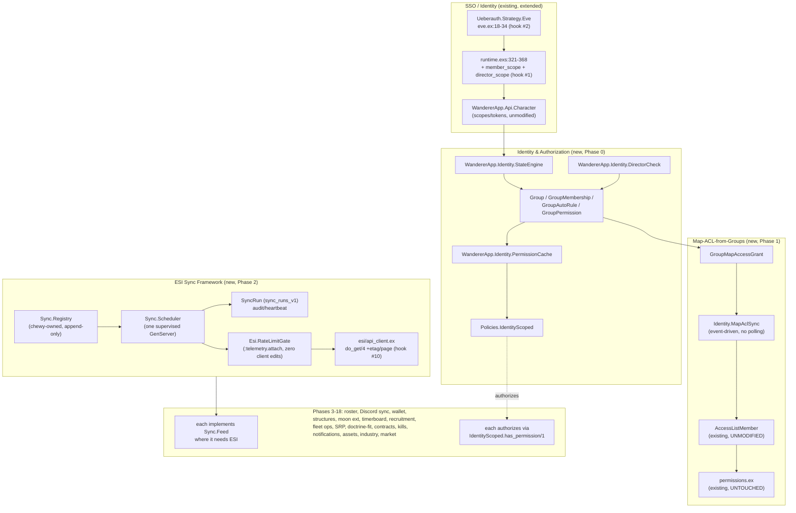

# Corp/Alliance Management Suite — Full-Suite Build Plan

**Supersedes** the Scope-2 recommendation in the previous revision of this document and in
`docs/chewy/corp-suite-research.md`. The owner has decided, verbatim: *"We have no seat and I do
not want to have 2 different auths for my group. I would therefore like fully fledged management
in our tool. Feel free to merge features in from other sources such as seat."* There is no SeAT,
no Alliance Auth, and there will not be one — **this app becomes the alliance's single
authentication + authorization + management platform.** Every item the research doc's §D deferred
to SeAT/Alliance Auth, and the old §10 appendix costed as "if the answer is full suite," is now in
scope. Read `docs/chewy/corp-suite-research.md` for the domain feasibility case (still accurate on
the ESI-availability facts, just no longer gated by the Scope 2/3 choice) and
`docs/chewy/inventory.md` for verified codebase facts. Every existing-file claim below is
`path:line` against `chewy` as re-verified 2026-09-27; a companion `docs/chewy/seat-parity.md` is
being written concurrently by another agent and will be reconciled against this doc in a follow-up
pass — §2 and §3 below are written to be diffable against it, not to require a rewrite.

---

## 1. Decision summary

- **Identity is the spine, not a feature.** A `State` (Member/Blue/Guest/Applicant) and `Group`
  membership/permission model, built on the same Ash-resource + `Ash.Policy.Authorizer` idiom
  already in the codebase, becomes Phase 0 — mandatory, not optional, because every later phase's
  authorization gate (who can approve SRP, who can see corp assets, who can edit a fleet op) reads
  from it.
- **Map ACL bitmask (`lib/wanderer_app/permissions.ex:1-62`) is never touched.** It stays
  map-scoped exactly as today. The new Group model *drives* map access by writing ordinary
  `WandererApp.Api.AccessListMember` rows through its **existing, unmodified** `:create`/
  `:update_role`/`:destroy` actions (`lib/wanderer_app/api/access_list_member.ex:57-69`) — a group
  becomes map access without a single edit to either file. This is the headline feature: it is the
  one thing SeAT/Alliance Auth structurally cannot do, because they don't own the map.
- **`director` stays ESI-derived, forever.** No stored boolean, no manually-editable "make myself
  director" row. Every later phase's director-gated feature reads a live-checked, short-TTL-cached
  group membership, not a persisted flag — same posture as the previous revision's `CorpAuthz`,
  generalized into the Group system instead of a bespoke module.
- **One shared ESI sync framework**, designed once, used by every one of the ~12 sync-needing
  phases (roster, structures, contracts, assets, industry, mining, wallet, market, notifications,
  killmails-if-ever-needed, standings, moon extraction) instead of a bespoke GenServer per feature.
  Decision: **hand-rolled scheduler + behaviour, not Oban** (§4 justifies this).
- **One maximal member SSO scope tier**, not incremental per-feature consent (§5 justifies this).
  The mapper's current login (`default_scope`, 5 scopes, no consent-screen change) keeps working
  byte-for-byte when the suite is off — that is non-negotiable and is the first acceptance
  criterion of Phase 0.
- **19 phases (0–18)**, each independently shippable, independently revertible by flipping one env
  var back to its default, ordered by value per unit of ongoing maintenance cost with hard
  dependencies made explicit. Total merge-cost ledger: **11 numbered hooks**, zero new
  `mix.exs` dependencies (§9 explains how Discord role sync avoids one).

---

## 2. Identity & authorization spine

### 2.1 Two axes, not one

Alliance Auth's proven split, reused rather than reinvented:

| Axis | Answers | Granularity | Source of truth |
|---|---|---|---|
| **State** | "Is this person one of us, and how much?" | Per `User`, via one self-designated **main** character (§2.2) — alts never contribute | Computed: main character's corp/alliance affiliation + explicit allow-lists |
| **Group** | "What can this person specifically do?" | Per `User`, many-to-many | Auto-derived from state/corp/alliance/title, plus manual grant/request-approve |

Both are new, additive resources under `WandererApp.Api`. Neither reads nor writes
`lib/wanderer_app/permissions.ex` — that bitmask stays a *map*-scoped concept; State/Group is an
*alliance*-scoped concept, composed only at the UI layer (a page may show both a map-admin badge
and a corp-director badge; they are unrelated checks).

### 2.2 State

State is computed from the user's designated **main** character only — never "any character the
user owns." This is a deliberate, security-relevant choice: an alt sitting in a member corp must
not grant full member privileges (Groups, permissions, Discord roles, map access) to a user whose
*main* has left the alliance. An any-character rule leaves a real, quiet hole — a departing member
who leaves (or deliberately keeps) an alt parked in a member corp keeps full `:member` state
indefinitely, with no in-game signal an admin would notice; "some rando's alt in corp" is
unremarkable. Alliance Auth computes state the same way for the same reason; this plan follows it
rather than inventing an any-character shortcut.

`WandererApp.Api.UserIdentity` (new resource, `user_identities_v1`, full attribute table in §8) —
**not** a new attribute on `WandererApp.Api.User`. `lib/wanderer_app/api/user.ex:1-136` is
upstream-owned and carries its own `authorizers`/`extensions`/`policies`/`json_api`/`cloak` blocks
(`:4-8,15-33,44-56,105-109`); every edit to it is also an edit to
`priv/resource_snapshots/repo/users/*.json`, and a bad snapshot resolution silently desyncs codegen
(`docs/chewy/inventory.md` §11) — strictly worse than a code conflict. A one-to-one sibling
resource keyed on `user_id` gets `main_character_id` and `state` with **zero edits to `user.ex`
and zero snapshot churn**.

**Main designation is self-service and has no silent fallback.** A user picks a main from among
their own linked characters on a new `/corp/identity` page (Phase 0). `main_character_id` is `nil`
until they act, and `nil` computes to `:guest` unconditionally — no "first character created"
default, no convenience fallback. A user must take a visible action to gain any privileged state.
Re-designating a main triggers an immediate recompute (own code, not a hook) and, once Phase 4
ships, a Discord nickname re-sync keyed to the new main's name.

| State | Meaning | Computed from |
|---|---|---|
| `:member` | Main character is in an alliance-owned corp | `main_character.corporation_id`/`alliance_id` (`lib/wanderer_app/api/character.ex:211-216`) matches a row in `owned_corporations_v1` (§2.6) |
| `:blue` | Allied/trusted outsider | Manual row in `standing_grants_v1`; may key off *any* linked character's corp/alliance/character ID, not only the main — `:blue` carries no Group permissions by construction (§2.3), so the any-character shortcut that's unsafe for `:member` is low-stakes here |
| `:applicant` | Has an open application | `RecruitmentApplication` row exists for this user (Phase 9; atom exists inert from Phase 0) |
| `:guest` | No main designated, or main matches neither of the above | Default |

`WandererApp.Identity.StateEngine` (new file, plain module):

```elixir
def recompute!(%User{} = user)                            # idempotent; upserts UserIdentity.state
def state_of(%User{} = user)                               # cached read, same pattern as DirectorCheck
def set_main!(%User{} = user, %Character{} = character)    # validates ownership, recomputes
```

**Recompute triggers** (§5 has the exact hook list):
1. On login, right after the existing affiliation refresh (`auth_controller.ex:68-158`) — **only
   when the affected character is the user's designated main**; an alt's affiliation change is
   still stored (`Character.update_corporation/2` etc., unchanged) but does not move `state`.
2. On tracker-driven affiliation change **to the main specifically** —
   `lib/wanderer_app/character/tracker.ex`'s `maybe_update_corporation/1`/`maybe_update_alliance/1`
   gain one added guard (`character.id == main_character_id`) before calling `recompute!/1`, so a
   kicked main loses `:member` state without waiting for next login, and alt churn doesn't trigger
   needless recomputes.
3. Daily Quantum job (`recompute_all/0`, appended to `config/runtime.exs:396-404`) — catches anyone
   whose state should have changed but who hasn't logged in.
4. On `set_main!/2` (own code, not a hook).

### 2.3 Group

`WandererApp.Api.Group` (`groups_v1`): `id`, `name`, `description`, `kind` (`:auto` | `:manual` |
`:hybrid`), timestamps.

`WandererApp.Api.GroupMembership` (`group_memberships_v1`): `group_id`, `user_id`, `source`
(`:auto_rule` | `:manual_grant` | `:self_request`), `status` (`:active` | `:pending`),
`granted_by_user_id` (nullable, audit trail), timestamps. Identity: `[:group_id, :user_id]`.

`WandererApp.Api.GroupAutoRule` (`group_auto_rules_v1`): `group_id`, `match_kind`
(`:state` | `:corporation_id` | `:alliance_id` | `:title` | `:esi_director_role`), `match_value`
(string — the state atom, the corp/alliance ID, the in-game title, or unused for
`:esi_director_role`). A group can have multiple rules (OR'd) — e.g. "FCs" group = manual grants
only (no auto-rule row), "Directors" group = one `:esi_director_role` auto-rule, "All Members"
group = one `:state` rule matching `:member`.

`WandererApp.Api.GroupPermission` (`group_permissions_v1`): `group_id`, `permission` (`:atom`, open
vocabulary — `:srp_approve`, `:fleet_fc`, `:recruiter_review`, `:corp_wallet_view`,
`:corp_suite_admin`, etc., one row per permission a group carries, not a fixed enum baked into the
schema). This directly replaces the previous revision's 2-atom `CorpRoleAssignment.role`
(`:recruiter`/`:fc`) with an open vocabulary that scales to every later phase's need without a
schema migration per phase — a new permission atom is a new *row*, not a new *column value
constraint*.

**Director stays out of `GroupPermission`'s manual-grant path.** The "Directors" group's
membership is populated *only* by the `:esi_director_role` auto-rule (§2.4), never by a manual
`GroupMembership` row with `source: :manual_grant` — enforced by an Ash validation on
`GroupMembership.create` that rejects `source: :manual_grant` when the target group has an
`:esi_director_role` auto-rule. This is the same non-negotiable the previous revision stated for
`CorpRoleAssignment`, now enforced structurally on the shared table rather than by a resource that
simply omits the `:director` atom.

### 2.4 Director derivation (unchanged principle, generalized mechanism)

`WandererApp.Identity.DirectorCheck` (new file, replaces the previous revision's `CorpAuthz`):

```elixir
def esi_director?(%Character{} = character, corporation_id)
```

1. Reject fast if `character.corporation_id != corporation_id` or `character.scopes` doesn't
   contain `esi-characters.read_corporation_roles.v1` (same string-membership style as
   `Character.can_track_wallet?/1` cited in the research doc §B).
2. `Cachex.fetch(:esi_auth_cache, "director_v1:#{character.id}", fn -> ... end, ttl:
   :timer.minutes(15))` — reuses the existing `:esi_auth_cache` worker
   (`lib/wanderer_app/application.ex:68-71`), no new Cachex child.
3. On miss, call `GET /characters/{id}/roles/` and check `"Director" in roles`. Cache negatives
   too.

The `:esi_director_role` `GroupAutoRule` reads this on the same 15-minute cache; the group
membership recompute (§2.7's periodic job) re-evaluates it exactly like every other auto-rule, so
"director" needs **zero special-case code path** through the rest of the Group system — it is an
auto-rule like any other, just one whose evaluator happens to call ESI instead of comparing a
column. **Staleness window:** unchanged from the previous revision's documented 15 minutes for
UI-level gating only; every ESI call the app subsequently makes with that character's token is
independently re-checked by CCP at call time, which is the real backstop.

### 2.5 Map-ACL-from-groups (the headline feature)

`WandererApp.Api.GroupMapAccessGrant` (`group_map_access_grants_v1`): `group_id`, `access_list_id`,
`role` (reuses the exact `AccessListMember.role` enum: `:admin`/`:manager`/`:member`/`:viewer`/
`:blocked`, `lib/wanderer_app/api/access_list_member.ex:135-150`).

`WandererApp.Api.GroupMapSyncedMember` (`group_map_synced_members_v1`, shadow/ownership table):
`group_map_access_grant_id`, `access_list_member_id`. Exists so the sync process can tell "a row I
created" from "a row an admin hand-added," and only ever touch its own rows.

**Sync logic** (`WandererApp.Identity.MapAclSync`, new module, invoked on `GroupMembership`
create/destroy and on `GroupMapAccessGrant` create/update/destroy — no polling needed, it's
event-driven):

- For a **state-derived** or **corp/alliance-derived** group (its only auto-rule is `:state`,
  `:corporation_id`, or `:alliance_id`), sync writes **one** `AccessListMember` row per matching
  `(corporation_id | alliance_id)`, using the resource's *existing* principal-by-corp/alliance
  fields (`eve_corporation_id`/`eve_alliance_id`, `lib/wanderer_app/api/access_list_member.ex:125-
  133`) — no per-character enumeration needed, CCP's own affiliation is the filter, exactly the way
  a human admin would hand-configure an ACL today, just automated.
- For a **manual/hybrid** group (director grants, FC grants, request/approve), sync writes one
  `AccessListMember` row **per current member's character(s)** keyed by `eve_character_id`, added
  on `GroupMembership` create and removed (only the shadow-tracked row, never a hand-added one) on
  `GroupMembership` destroy or `status` transition away from `:active`.
- All writes go through `AccessListMember`'s existing `:create`/`:update_role`/`:destroy` code
  interface actions (`lib/wanderer_app/api/access_list_member.ex:57-69`) with `actor: nil,
  authorize? false` (an internal/system write, the same posture already used elsewhere in the
  codebase for non-user-initiated changes) — `MapScoped.trusted()`'s bypass
  (`lib/wanderer_app/api/policies/map_scoped.ex:31-56`) is for *session* actors, this is a
  *system* actor, so the write intentionally skips policy evaluation entirely rather than
  impersonating a user.
- **Zero edits to `access_list_member.ex` or `permissions.ex`.** This is the concrete proof of the
  "compose at the policy layer, not the bitmask layer" principle stated for the whole plan.

### 2.6 `owned_corporations_v1` — renamed continuity from the previous revision's `CorpProfile`

Same shape and same Phase-0-boot seeding behavior the previous revision specified for
`CorpProfile` (seeded from the already-live `WandererApp.Env.corp_eve_id/0` /
`corp_wallet_eve_id/0`, `lib/wanderer_app/env.ex:82-84`) — renamed because a full-suite alliance
identity platform needs to represent "which corp(s) are ours" as a first-class, possibly-plural
concept from day one (an alliance may own several corps), not a name that implies exactly one. The
`director_character_id` re-pointing field, the "director leaves" mitigation, and the
create-if-absent-by-identity seeding-conflict behavior are unchanged from the previous revision's
§5 write-up (re-read there for the full attribute table — it is not repeated here since nothing
about it changed except the resource's name and its new use as the FK target for `GroupAutoRule`
and `SyncRun`, §3).

### 2.7 Policy module shape (new file, `lib/wanderer_app/api/policies/identity_scoped.ex`)

Mirrors `MapScoped`/`AclScoped`'s bypass-then-check shape
(`lib/wanderer_app/api/policies/map_scoped.ex:31-56`, `acl_scoped.ex:21-39`); the check uses
`is_struct/2`, never a `%User{}` struct pattern, for the exact reason documented at
`map_scoped.ex:36-42` — a compile-time struct pattern on `WandererApp.Api.User` closes a cycle back
through `User`'s own policy referencing this module, and `mix compile --force` deadlocks on it.
**Every policy check added in every later phase of this plan must follow this same rule** — it is
restated once here as the house law, not per-phase.

```elixir
defmodule WandererApp.Api.Policies.IdentityScoped do
  def trusted, do: {__MODULE__.Trusted, []}
  def has_permission(perm), do: {__MODULE__.HasPermission, permission: perm}
  def in_state(state), do: {__MODULE__.InState, state: state}

  defmodule Trusted do
    use Ash.Policy.SimpleCheck
    def describe(_), do: "actor is a session User"
    def match?(actor, _ctx, _opts) when is_struct(actor, WandererApp.Api.User), do: true
    def match?(_actor, _ctx, _opts), do: false
  end

  defmodule HasPermission do
    use Ash.Policy.SimpleCheck
    def describe(opts), do: "actor's user holds permission #{opts[:permission]}"

    def match?(actor, _ctx, permission: perm) when is_struct(actor, WandererApp.Api.User) do
      WandererApp.Identity.PermissionCache.has_permission?(actor.id, perm)
    end

    def match?(_actor, _ctx, _opts), do: false
  end

  defmodule InState do
    use Ash.Policy.SimpleCheck
    def describe(opts), do: "actor's user is in state #{opts[:state]}"

    def match?(actor, _ctx, state: state) when is_struct(actor, WandererApp.Api.User) do
      WandererApp.Identity.StateEngine.state_of(actor) == state
    end

    def match?(_actor, _ctx, _opts), do: false
  end
end
```

`WandererApp.Identity.PermissionCache.has_permission?/2` is a plain Ecto-backed join query (group
memberships → group permissions), no TTL needed for the same reason the previous revision gave for
`CorpRoleAssignment` reads — it's a direct grant table, Ecto's own connection pool is the caching
layer, invalidated by row changes, not time.

---

### 2.8 Being the auth of record: account lifecycle (`seat-parity.md` §9)

Neither SeAT nor Alliance Auth handles most of this well either (`seat-parity.md` §9.1-§9.6
document their own gaps alongside the requirement) — but "AA doesn't really solve it either" stops
being an acceptable answer the moment there is no AA to fall back on. Six concrete obligations,
each with a phase, a resource, and an acceptance criterion — all Phase 0, since every one of them
is foundational trust infrastructure, not a deferrable feature.

#### 2.8.1 Character ownership integrity — a pre-existing bug fix, not new scope

**Finding:** `lib/wanderer_app_web/controllers/auth_controller.ex:29-31` already extracts
`CharacterOwnerHash` from every SSO callback — the exact CCP-provided signal that changes when a
character is transferred to a new EVE account (`seat-parity.md` §9.2) — but **never persists it**:
neither `character_data` (`:19-27`, the create path) nor `character_update` (`:36-43`, the update
path) includes `character_owner_hash`, even though `Character` has had a `character_owner_hash`
column since before this plan (`lib/wanderer_app/api/character.ex:199`). Worse: when a
session-anonymous login resolves its `User` (`:83-106`), a hash miss falls through to
`character.user_id` — the **character row's existing, stale owner link** — meaning a character
transferred to a new real-world owner who logs in via legitimate SSO is silently attached to the
**previous owner's** `User` account, with no hash comparison ever performed. This is a
pre-existing correctness bug, independent of this plan, that becomes an account-takeover-shaped
problem the moment this app is the alliance's only auth (a buyer's SSO login could otherwise land
them inside the seller's session, with the seller's other characters, groups, and permissions
visible).
**Fix, hook #8 (the same `auth_controller.ex` hook already budgeted for state recompute):**
persist `character_owner_hash` on both the create and update paths; on update, if the existing row
already has a non-nil `character_owner_hash` that **differs** from the incoming value, treat it as
a transfer event (§2.8.2) instead of a normal token refresh.
**Acceptance criteria:** a `Character` row's `character_owner_hash` is populated on first login
and every subsequent login; a synthetic hash change in a smoke test triggers the transfer path,
not a silent reassignment.

#### 2.8.2 Character transfer / sale

On a detected hash change (§2.8.1): detach the character from its old `user_id` (set to `nil`,
don't delete the `Character` row — its `eve_id` is a stable CCP identifier, transfer doesn't change
it), log an `AuditLog` entry (§2.8.5) with `action: :character_transfer_detected`, attach the
character to the *current session's* `User` if one exists, otherwise treat this login exactly like
any new character's first login (create a fresh `User` if `User.by_hash/1` also misses). If the
transferred character was the old user's designated **main** (§2.2), that user's state recomputes
to `:guest` on next recompute — the same code path as an alt-only user losing their main, no
special case.
**Acceptance criteria:** a smoke test that changes a seeded character's stored
`character_owner_hash` and re-triggers the callback flow results in the character detaching from
the original `User`, not silently staying attached.

#### 2.8.3 Account recovery

Adds `disabled_at`, `disabled_by_user_id`, `disabled_reason` to `user_identities_v1` (§8). Two new
`StateEngine` functions:
```elixir
def disable!(%User{} = target, %User{} = admin, reason: reason)
def reactivate!(%User{} = target, %User{} = admin)
```
`state_of/1` short-circuits to `:guest` whenever `disabled_at` is set, **before** running the
normal computation — so one admin action cuts every downstream consequence (Group auto-rule
membership, therefore map access via Phase 1 and Discord roles via Phase 4) through the *existing*
recompute machinery, with zero new integration code per downstream phase. Both actions log an
`AuditLog` entry. `reactivate!/2` does not restore prior manual `GroupMembership` grants (role
grants earned before a disable are not silently un-revoked) — only clears the override, so state
recomputes from scratch on the affected user's next login.
**Acceptance criteria:** disabling a `:member` user immediately drops their state to `:guest`
without waiting for their next login (an admin-facing LiveView action, not a login-triggered one);
their Group memberships, map access, and Discord roles (whichever of Phases 1/4 are live) follow
within one recompute cycle; reactivating restores normal computation but does not auto-restore
manually-granted permissions.

#### 2.8.4 Leave-and-rejoin — already handled, restated for completeness

No new mechanism: §2.2's recompute triggers already re-derive state from scratch on every login
and daily cron, so a member who leaves and later rejoins the same or a different owned corp gets
correct state on their very next login — this is the existing design working as intended, not a
gap. Historical record is preserved by construction: `Character` rows are never deleted on a
corp-leave, only `state`/`GroupMembership` change, so a rejoined member's prior activity history
(roster data, fleet attendance, SRP history, etc. — whichever phases are live) is intact, not
duplicated under a second `User` row.
**Acceptance criteria:** a smoke test that flips a seeded character's `corporation_id` away from
and then back to an `OwnedCorporation` match, with a `recompute!/1` call after each change, ends
with the same `User` row, the same `UserIdentity` row, and `:member` state restored — never a
second `User` created for the same EVE character.

#### 2.8.5 Audit logging — new resource

`WandererApp.Api.AuditLog` (`audit_logs_v1`): `id`, `actor_user_id` (nullable — `nil` = system),
`target_user_id`, `action` (`:atom`, open vocabulary — `:role_grant`, `:role_revoke`,
`:state_change`, `:group_add`, `:group_remove`, `:main_character_change`,
`:character_transfer_detected`, `:account_disabled`, `:account_reactivated`, `:gdpr_deletion` —
same open-vocabulary-atom pattern as `GroupPermission.permission`, §2.3), `details` (`:map`,
free-form JSON), `inserted_at`. Write-only from the app's own perspective — every mutation in
§2.8.1-§2.8.3 and every manual `GroupMembership`/`GroupPermission` grant or revoke calls
`WandererApp.Identity.Audit.log!/1`; nothing reads this table except an admin-facing "history"
view and a user-facing "your account history" view (`seat-parity.md` §9.5's two query shapes, both
plain Ecto reads, no new pattern). No purge — an audit trail that purges itself defeats its
purpose; retention is addressed instead by §2.8.6's redaction-not-deletion policy.
**Acceptance criteria:** every Phase-0 mutation (main-character change, manual group grant,
account disable/reactivate, detected transfer) produces exactly one `AuditLog` row; a user can
view their own history; an admin can view a target user's history.

#### 2.8.6 GDPR / PII deletion — framework now, cascades registered per phase

Mirrors the retention-framework discipline already established for `Sync.Feed` (§3.5): a
`WandererApp.Identity.Gdpr` behaviour with one callback,
```elixir
@callback purge_for_user(user_id :: Ecto.UUID.t()) :: :ok
```
that **every phase adding a PII-bearing, user-linked resource must implement and register** —
enforced the same way retention is: the behaviour won't compile without it. Phase 0's own
implementation soft-deletes (`User.deleted_at`, never a hard delete — matches `seat-parity.md`
§9.6's explicit "must NOT delete" list: killmail references, wallet transactions, and structure
timer edit history survive a user deletion, scrubbed of directly-identifying fields but not
erased, because deleting them would be a financial/opsec liability, not a privacy win) and scrubs
`User.email`, `Character.name` (replaced with `"[deleted]"`), revokes and blanks every stored
token. `AuditLog` rows referencing the deleted user are **not** deleted — `details` referencing
them is passed through a redaction step (`"User [deleted-#{short_id}] was kicked from Director
role"`) so the audit trail's own integrity survives a subject's deletion — `seat-parity.md` §9.6
notes AA's own GDPR plugin requires manual admin execution with no built-in audit-log handling at
all; this design is one step ahead of AA's by construction, not by accident.
**Workflow:** user requests deletion on `/corp/identity` → admin reviews (not self-service-instant,
since it also blanks Discord links, ACL grants, etc. an admin may want to sanity-check first) →
user re-confirms → `Gdpr.delete_user!/1` runs, calling every registered `purge_for_user/1`
callback.
**Acceptance criteria:** deleting a Phase-0-only user (no other phases live) scrubs `User`/
`Character`/`UserIdentity` PII, leaves a redacted `AuditLog` trail, and the deleted user can no
longer log in (their next SSO callback creates a **new** `User` row rather than resurrecting the
deleted one — deletion is final, matching "right to be forgotten," not a soft-pause).

## 3. ESI sync framework

### 3.1 Why a framework, not twelve pollers

The previous revision hand-rolled one GenServer per feature (`StructurePoller`, `ContractPoller`,
`AllianceKillStatRoller`) — workable at 3 pollers, not at the ~10 this plan needs (structures,
moon extractions, contracts, assets, industry jobs, mining ledger, corp wallet journal, market
orders, corp membership roster, ESI notifications, standings). Each poller would otherwise
duplicate: cadence timer, ETag cache, 420-backoff, pagination, retry-on-crash, and an audit
heartbeat — exactly the kind of duplicated logic this codebase already avoids for character
tracking (one pool-based tracker, not one GenServer per character, per
`lib/wanderer_app/character/tracker_pool*.ex`).

### 3.2 Quantum vs. bespoke GenServers vs. Oban — decision: bespoke, no new dependency

| Option | Verdict | Why |
|---|---|---|
| **Quantum** (existing, `WandererApp.Scheduler`) | Keep for what it already does | Fire-and-forget MFA cron (`config/runtime.exs:396-404`) has no per-job state, no retry policy, no per-endpoint cadence, no concurrency limit — wrong shape for "poll 10 different ESI endpoints at 10 different cadences with backoff and an audit trail" |
| **Oban** (new dependency) | **Rejected** | Buys persistent job state, retries, and a queue UI — real value, but at ~100 characters and a dozen feeds with cadences in minutes-to-hours (not per-second), it is materially more operational surface (its own migration, queue config, pruning, a library one person must track across Elixir/Oban releases) than this plan's actual throughput needs. Revisit only if character count or feed count grows by an order of magnitude. |
| **Bespoke scheduler + behaviour** (chosen) | **Built** | One supervised GenServer plus a small behaviour every feed module implements — the same "one supervised thing, many registered workers" shape already proven at 3000+-character scale by `WandererApp.Character.TrackerPool`/`TrackerManager` (`docs/chewy/inventory.md` §7's concurrency note). Zero new dependency, zero new operational surface beyond one more table. |

### 3.3 Shape

`WandererApp.Sync.Feed` (new file, behaviour):

```elixir
@callback cadence_seconds(scope :: term()) :: pos_integer()
@callback token_holder(scope :: term()) :: {:character, Character.t()} | {:corp_director, term()}
@callback fetch(scope :: term(), etag :: String.t() | nil) ::
            {:ok, data :: term(), etag :: String.t()} | :not_modified | {:error, term()}
@callback upsert(scope :: term(), data :: term()) :: :ok
@callback retention_days() :: pos_integer() | :infinity
@callback purge_stale(scope :: term()) :: :ok
```

`WandererApp.Sync.Registry` (new file, chewy-owned, append-only): a static list of
`{feed_module, scope_resolver}` pairs — every new phase that adds a sync feed adds one line here,
**zero upstream-file edits**, unlike the previous revision's per-poller `application.ex` entry.

`WandererApp.Sync.Scheduler` (new file, one supervised GenServer, started via the one new
`application.ex` hook in §5): ticks every 30s, for each registered feed × scope due (per its
`sync_runs_v1` heartbeat row and `cadence_seconds/1`), spawns a supervised `Task` that:
1. Checks the global error-limit gate (§3.4) before calling out.
2. Calls `fetch/2` with the row's last-known `etag`.
3. On `:not_modified`, only bumps `last_checked_at` — no upsert, no write load.
4. On `{:ok, data, etag}`, calls `upsert/2`, then updates `sync_runs_v1` (`last_success_at`, new
   `etag`, `consecutive_failures: 0`).
5. On error, increments `consecutive_failures`, applies exponential backoff to `next_run_at`
   (capped), and after 5 consecutive failures flips the row's `status` to `:stalled` — the signal
   that makes a silently-403ing feed visible instead of invisible (the exact gap the research doc's
   §C "director leaves" risk called out as unmitigated in the corp-wallet feature today).

`WandererApp.Api.SyncRun` (`sync_runs_v1`): `id`, `feed_name` (string), `scope_key` (string, e.g.
a corp ID or character ID), `status` (`:ok`/`:stalled`/`:disabled`), `etag`, `last_success_at`,
`last_error`, `last_error_at`, `consecutive_failures`, `next_run_at`. One row per
`(feed_name, scope_key)` pair — this is the audit/heartbeat table the prompt asks for, generic
across every feed rather than per-feature.

### 3.4 ETag, 420 backoff, pagination — all additive to the ESI client

- **420 / error-limit backoff:** `lib/wanderer_app/esi/api_client.ex:360-420` (and the three other
  call sites at `:513-543`, `:578-608`, `:610-638`) already parses `x-esi-error-limit-remain`/
  `x-esi-error-limit-reset` and emits `:telemetry.execute([:wanderer_app, :esi, :rate_limited],
  ...)` on every rate-limited response. The framework's `WandererApp.Esi.RateLimitGate` (new file)
  subscribes to that existing telemetry event via `:telemetry.attach/4` at its own `init/1` —
  **this needs zero edit to `api_client.ex` for backoff specifically**, since the signal already
  exists and is already public. The gate stores remaining/reset in the existing `:esi_auth_cache`
  (namespaced key, no new Cachex child) and the Scheduler checks it before every dispatch.
- **ETag:** genuinely absent today (`grep` for `ETag`/`If-None-Match` across `api_client.ex`
  returns nothing). This is the one real gap: the private `do_get/4` helper
  (referenced throughout `api_client.ex`, e.g. via `get_character_auth_data/3` and
  `get_corporation_auth_data/3` per the research doc §B) needs a narrow signature extension to
  thread an `etag:` opt into the request headers and capture the response `ETag` header back out.
  This is hook #10 in §5 — a single function's opt-list grows, every existing caller is unaffected
  since it's backward-compatible keyword-opt addition, not a positional-arg change.
- **Pagination:** ESI's heavy endpoints (assets, contracts, corp members) page via an `X-Pages`
  response header. The same `do_get/4` extension adds a `page:` opt; `WandererApp.Sync.Feed`
  implementations that need multi-page fetches loop calling `fetch/2` with incrementing page
  numbers until `X-Pages` is exhausted, accumulating into one `upsert/2` call per scope — kept in
  the feed module, not the framework, since only a handful of feeds (assets being the worst case)
  actually need it.

### 3.5 Retention is framework-level, not per-feature

`retention_days/0` + `purge_stale/1` are callbacks every feed module must implement (compile-time
enforced by the behaviour). One new Quantum job (`WandererApp.Sync.Retention.purge_all/0`, appended
to `config/runtime.exs`'s existing jobs list) iterates `WandererApp.Sync.Registry` daily and calls
each feed's own purge — this directly answers the brief's requirement that retention "must be part
of the framework, not a per-feature afterthought": there is no code path to ship a new sync feed
*without* declaring a retention policy, because the behaviour won't compile without the callback.

---

## 4. Token / consent strategy

### 4.1 One maximal member scope tier, not incremental consent

**Decision:** at full-suite scale, every ordinary member grants one broad `member_scope` bucket at
login — **trimmed to exactly the scopes a phase in this roadmap consumes**, not a maximal
everything-ESI-offers grab, cross-checked against `seat-parity.md` §5.1's full catalogue:

| Scope | Consumed by | Source |
|---|---|---|
| `esi-location.read_location.v1` | Existing map/character tracking (unchanged) | `seat-parity.md` §5.1 |
| `esi-location.read_ship_type.v1` | Existing map/character tracking (unchanged) | §5.1 |
| `esi-location.read_online.v1` | Existing tracking; supplements Phase 3's roster feed | §5.1 |
| `esi-ui.write_waypoint.v1` | Existing map/character tracking (unchanged) | §5.1 |
| `esi-search.search_structures.v1` | Existing map UI (unchanged) | §5.1 |
| `esi-wallet.read_character_wallet.v1` | Existing wallet tier, folded in | §5.1 |
| `esi-skills.read_skills.v1` | Phase 12 doctrine-fit | §5.1 |
| `esi-skills.read_skillqueue.v1` | Phase 12 doctrine-fit | §5.1 |
| `esi-fittings.read_fittings.v1` | Phase 12 doctrine-fit (confirms a fit is saved) | §5.1 |
| `esi-assets.read_assets.v1` | Phase 16 character asset ledger | §5.1 |

`esi-characters.read_notifications.v1` and `esi-mail.read_mail.v1` are **deliberately not** in
this bucket — `seat-parity.md` §10.2 is explicit that a member's own notification feed is useless
for corp-wide pings ("NOT useful for corp pings"), so requesting it from every member would be
consent-screen bloat with zero payoff; Phase 15 requests it from one designated relay character
only. `esi-clones.read_clones.v1`/`read_implants.v1` and
`esi-contracts.read_character_contracts.v1` are dropped from an earlier draft's bucket for the
same reason — no phase in this roadmap consumes them; an unconsumed scope on every member's
consent screen is a cost with no matching feature.

A separate `director_scope` tier (superset again, adding the corp-wide/role-gated reads —
`esi-characters.read_corporation_roles.v1`, `esi-corporations.track_members.v1`,
`esi-corporations.read_structures.v1`, `esi-wallet.read_corporation_wallets.v1`,
`esi-contracts.read_corporation_contracts.v1`, `esi-assets.read_corporation_assets.v1`,
`esi-industry.read_corporation_jobs.v1`, `esi-industry.read_corporation_mining.v1` — all cited
`seat-parity.md` §5.2) is requested only through an explicit "request director access" flow, same
shape as the existing `admin=true` tier (`lib/wanderer_app/ueberauth/strategy/eve.ex:18-34`,
`config/runtime.exs:321-334`). A third, much smaller **relay scope**
(`esi-characters.read_notifications.v1` only) is requested from whichever single character Phase
15 names as the notifications relay — not every member, not even necessarily a director
(`seat-parity.md` §10.2).

**Why not incremental per-feature consent:** EVE SSO's authorize screen shows one scope list per
authorization request regardless of how many scopes are in it — asking for 10 scopes costs the
member exactly the same number of clicks as asking for 5 (one "Authorize"). Incremental consent
buys no UX improvement and costs real engineering: N different consent flows, N different
partial-scope states to render around in every feature ("this member hasn't granted skills yet"),
and CCP's OAuth is **all-or-nothing per request** — a member cannot decline scope 7 of 10 and
accept the rest; declining means declining the entire authorize request. So "graduated consent"
was never actually available as a UX; the only real choice is bucket *size*, and this design
argues for the smallest bucket that still covers every phase, not the largest bucket that
plausibly could.

**Scope strings verified:** every scope string above is cross-checked against
`docs/chewy/seat-parity.md` §5 (its own author independently caught and fixed one invented string,
`esi-structures.read_corporation_structures.v1` → `esi-corporations.read_structures.v1`, per its
"Scope Strings Verified" section — this plan's equivalent string was already correct before this
reconciliation pass, checked against the same source, not assumed). **One gap remains, stated
honestly rather than papered over:** Phase 18's `esi-markets.read_character_orders.v1` /
`esi-markets.read_corporation_orders.v1` are **not** covered by `seat-parity.md` §5's catalogue (it
has no markets section) — these are standard, well-known ESI scope strings from prior knowledge,
not independently re-verified against a live source in this pass; confirm before Phase 18
implementation.

### 4.2 Existing three-tier system's fate

`default_scope`/`wallet_scope`/`admin_scope` (`config/runtime.exs:321-334`) **stay exactly as they
are when `WANDERER_IDENTITY_SUITE=false`.** When the suite is on, `default_scope` is what ordinary
login requests — the config value itself changes (this is the one config-level behavior change the
whole plan makes), from the current 5-scope mapper-only set to the new maximal `member_scope`
superset (which still includes all 5 original scopes, so nothing existing breaks). `wallet_scope`
and `admin_scope` become vestigial once `member_scope` is a superset of both — Phase 0 does not
delete them (an env-flag rollback to `false` must restore the exact current three-tier behavior),
but no new login path references them once the suite is live.

### 4.3 Adding director scopes to an existing character

Unchanged mechanically from the previous revision's documented risk: EVE SSO has no "add a scope"
— it is a brand-new authorize request. A director clicks "Request director access" (the one
modified line in `characters_live.ex`, hook #3), goes through a second full OAuth round trip on the
*same* EVE character, and the returned token **overwrites** that `Character` row's
`scopes`/`access_token`/`refresh_token` via the existing `update_character/2`
(cited in the previous revision's risk table as already Cachex-coalescing) — trackers re-read from
cache each poll, so this is a refresh, not a restart.

### 4.4 What the UI tells a member, and what happens if they decline

The `/welcome` and character-authorize pages (new copy, not new mechanism) state plainly which
features the requested scope bucket powers ("logging in lets the alliance see your last-login,
skills, and assets for roster/doctrine-compliance/loot-tracking features — declining means you
can't use those pages, but you can still use the map"). **Declining the whole request** means the
character never gets a `Character` row created (today's exact behavior for any failed OAuth
callback) — they simply cannot log in at all, full stop, for *any* feature including the map. This
is a materially different answer than the old Scope-2 plan's "member declines wallet, still gets
everything else" — because this app is now the *only* auth, "decline everything" is equivalent to
"don't use the tool," not a partial-degradation state to design UI around.

### 4.5 Existing users must re-consent once

Every `Character` row created before Phase 0 ships has only the old `default_scope` (or
`wallet_scope`/`admin_scope`) grant. On suite launch, those characters function exactly as before
for map/character-tracking features (their token still covers what it always covered) but every
corp-suite page shows a "reauthorize to unlock this" prompt for that specific character until they
click through one more OAuth round trip against the new `member_scope`. No forced mass re-login,
no account lockout — an honest, visible degraded state per-character until they opt in, exactly the
same mechanism as §4.3's director-upgrade flow, reused rather than invented twice.

---

## 5. Numbered hooks (edits to existing files — the full merge-cost budget)

All 19 phases share this same 11-hook budget; a phase's own section in §9 cites which of these 11
it touches, it never introduces a 12th.

| # | Hook | File(s) | Why it's unavoidable |
|---|---|---|---|
| 1 | SSO scope tiers (`member_scope`/`director_scope` + credential pairs) and Quantum job-list append (sync purge, state recompute) | `config/runtime.exs:321-368,396-404` | Same block the previous revision already extends for a 4th tier; now extends to the maximal-member shape (§4) plus two new cron entries |
| 2 | Scope-selection `cond` extended | `lib/wanderer_app/ueberauth/strategy/eve.ex:18-34` | 4th/5th branch for `member?`/`director?` flags, same shape as the 3 branches already there |
| 3 | One modified line in `"authorize"` `handle_event` | `lib/wanderer_app_web/live/characters/characters_live.ex:62-77` | Same single-line-not-clause constraint the previous revision documented (Elixir clause matching forbids a duplicate identical head) |
| 4 | New router scopes: `/corp` `live_session`, per-phase route lines, `/discord` interactions endpoint | `lib/wanderer_app_web/router.ex` | Self-contained blocks, same low-conflict shape as the existing `scope "/dev"` hook (`router.ex:507-513`) |
| 5 | Phase-0 nav wiring: one `assign` key, one sibling component call | `lib/wanderer_app_web/live/nav.ex:16-39`, `lib/wanderer_app_web/components/layouts/live.html.heex:16-21` | Both already carry a CHEWY PATCH precedent (`nav.ex:20-25`); all further nav entries land in a new chewy-owned `corp_nav.ex`, never touching these two again |
| 6 | New one-line getters, one per flag | `lib/wanderer_app/env.ex` | 100% ours already (every existing CHEWY PATCH uses this file) |
| 7 | New `maybe_start_*` clauses (`Sync.Scheduler`, Discord REST client) | `lib/wanderer_app/application.ex:151-156` | Same append-to-`children` pattern already proven for `maybe_start_corp_wallet_tracker/1` |
| 8 | One call to `StateEngine.recompute!/1` after the existing affiliation refresh, guarded to the user's designated main character | `lib/wanderer_app_web/controllers/auth_controller.ex:68-158` | State must be current the instant a member's main logs in, not just on the next daily cron |
| 9 | One call to invalidate director/group cache after token refresh | `lib/wanderer_app/ueberauth/strategy/eve/oauth.ex:85-113` | Same invalidation-on-refresh posture the previous revision specified for `CorpAuthz.invalidate/1` |
| 10 | `do_get/4` (and `do_post_esi/3` where relevant) gain `etag:`/`page:` opts | `lib/wanderer_app/esi/api_client.ex` | The one real gap (§3.4) — narrow, backward-compatible opt-list addition to a shared private helper, not to the ~20 per-endpoint public functions |
| 11 | One guarded call to `StateEngine.recompute!/1` inside affiliation-change handlers (main-character check added before the call) | `lib/wanderer_app/character/tracker.ex` (`maybe_update_corporation/1`, `maybe_update_alliance/1`) | A member whose *main* gets kicked from corp mid-session must lose `:member` state without waiting for next login; alt affiliation churn is a no-op |

**Explicitly zero-hook, called out because it's the load-bearing claim of §2.5 and §2:**
`lib/wanderer_app/permissions.ex` and `lib/wanderer_app/api/access_list_member.ex` are never
edited by any phase in this plan. **Zero new `mix.exs` dependencies** — Oban was rejected (§3.2),
Discord role sync uses a standard OAuth2 web flow + REST bot calls (§9 Phase 4, revised from an
earlier draft's signed-Interactions design after reconciling against `seat-parity.md` §4 — both
`oauth2` and `Req` are already dependencies), and the identity/group/sync resources are all plain
`Ash.Resource` + `AshPostgres`, both already dependencies too.

---

## 6. Merge-cost ledger

| # | Upstream churns this file? | Conflict shape | Fallback |
|---|---|---|---|
| 1 | Rarely — this whole config block is already ours | Pure append | Re-apply wholesale |
| 2 | Rarely — vendored strategy module upstream doesn't touch | New `cond` branches | 3-way merge trivially resolves |
| 3 | **Yes** — upstream's own clause | Token-level, not auto-mergeable | Small enough to eyeball-resolve every time; scope, not avoidance |
| 4 | Yes, moderately — upstream adds routes periodically | Self-contained blocks | Same shape as the already-battle-tested `scope "/dev"` hook |
| 5 | Yes, occasionally — both upstream files | Pure additions alongside an existing CHEWY PATCH | "Both add a key/line" conflicts, not semantic ones |
| 6 | No — 100% ours | N/A | Zero risk |
| 7 | Occasionally — upstream may add its own children | Our clauses append after upstream's | Same low-risk pattern already proven across a merge |
| 8 | Yes — upstream's own function body | One added line after an existing call | Small, obvious re-application on conflict |
| 9 | Rarely — vendored OAuth module | One added line | Trivial |
| 10 | Rarely — private helper, ~20 lines total in a large file | Opt-list addition | Trivial; callers unaffected |
| 11 | Yes — upstream's own tracker module | One added line per handler, 2 handlers | Small, obvious re-application |

**Overall:** hooks #1, #2, #6, #9, #10 are effectively upstream-merge-free. Hooks #3, #4, #5, #7,
#8, #11 touch files upstream also edits, but each is a small, additive, self-contained clause or
line — the same risk class already accepted for `WANDERER_PERSIST_TRACKING`'s 4 one-line hooks
(`AGENTS.md:36`). 11 hooks total is a larger surface than the previous revision's 7 because the
scope is now genuinely the whole platform's identity layer, not one corp-wallet UI — but it is not
11-times the merge risk, because 5 of the 11 sit in files that are already effectively
chewy-owned.

---

## 7. Target architecture



### New resources / tables master list

| Resource (new file) | Table | Phase |
|---|---|---|
| `WandererApp.Api.OwnedCorporation` | `owned_corporations_v1` | 0 |
| `WandererApp.Api.Group` | `groups_v1` | 0 |
| `WandererApp.Api.GroupMembership` | `group_memberships_v1` | 0 |
| `WandererApp.Api.AuditLog` | `audit_logs_v1` | 0 |
| `WandererApp.Api.GroupAutoRule` | `group_auto_rules_v1` | 0 |
| `WandererApp.Api.GroupPermission` | `group_permissions_v1` | 0 |
| `WandererApp.Api.StandingGrant` | `standing_grants_v1` | 0 |
| `WandererApp.Api.UserIdentity` | `user_identities_v1` | 0 |
| `WandererApp.Api.GroupMapAccessGrant` | `group_map_access_grants_v1` | 1 |
| `WandererApp.Api.GroupMapSyncedMember` | `group_map_synced_members_v1` | 1 |
| `WandererApp.Api.SyncRun` | `sync_runs_v1` | 2 |
| `WandererApp.Api.CorpRosterSnapshot` | `corp_roster_snapshots_v1` | 3 |
| `WandererApp.Api.DiscordLink` | `discord_links_v1` | 4 |
| `WandererApp.Api.GroupDiscordRoleMapping` | `group_discord_role_mappings_v1` | 4 |
| `WandererApp.Api.CorpStructureTimer` | `corp_structure_timers_v1` | 6 |
| `WandererApp.Api.MoonExtraction` | `moon_extractions_v1` | 7 |
| `WandererApp.Api.RecruitmentApplication` / `RecruitmentNote` | `recruitment_applications_v1` / `recruitment_notes_v1` | 9 |
| `WandererApp.Api.FleetOp` / `FleetOpAttendance` | `fleet_ops_v1` / `fleet_op_attendance_v1` | 10 |
| `WandererApp.Api.SrpRequest` / `SrpPayout` | `srp_requests_v1` / `srp_payouts_v1` | 11 |
| `WandererApp.Api.Doctrine` / `DoctrineFitting` | `doctrines_v1` / `doctrine_fittings_v1` | 12 |
| `WandererApp.Api.CorpContract` | `corp_contracts_v1` | 13 |
| `WandererApp.Api.AllianceKillStat` | `alliance_kill_stats_v1` | 14 |
| `WandererApp.Api.EsiNotification` | `esi_notifications_v1` | 15 |
| `WandererApp.Api.CorpAsset` / `CharacterAsset` | `corp_assets_v1` / `character_assets_v1` | 16 |
| `WandererApp.Api.IndustryJob` / `MiningLedgerEntry` | `industry_jobs_v1` / `mining_ledger_entries_v1` | 17 |
| `WandererApp.Api.MarketOrder` | `market_orders_v1` | 18 |

`WandererApp.Api.CorpWalletTransaction` (`lib/wanderer_app/api/corp_wallet_transaction.ex`) is
reused as-is for Phase 5 (backend already built, `docs/chewy/corp-suite-research.md` §B) — no new
resource, only a new LiveView.

### Supervision-tree children

| Child | Module (new file) | Starts when |
|---|---|---|
| Sync scheduler | `WandererApp.Sync.Scheduler` | `WANDERER_SYNC_FRAMEWORK=true` |
| Discord REST client / interactions verifier | `WandererApp.Discord.Client` | `WANDERER_DISCORD_SYNC=true` |

Both folded into `application.ex:151-156`'s `children = core_children ++ … ++ maybe_start_*` list,
hook #7. No new Finch pool — the sync framework reuses `WandererApp.Finch.ESI.General`
(`application.ex:31-41`) at hours-not-seconds cadence for heavy endpoints, same posture the
previous revision specified.

### JSON:API exposure

Unchanged decision from the previous revision, still correct: `/api/v1`'s auth model
(`WandererAppWeb.Plugs.CheckJsonApiAuth`, "Bearer token authentication only supports map API keys")
has no concept of "the alliance/corp this token represents," so **none of the new identity/group/
sync/feature resources are exposed via `/api/v1`** in this plan. Discord and any future bot
integration read via push (webhook/interactions), not pull. If a pull API is ever confirmed
necessary, the previous revision's "minimum viable alternative" (a `CheckCorpApiKey` plug mirroring
`CheckMapApiKey`) is still the right shape — not built here.

---

## 8. Data model detail — Phase 0 core tables

### `groups_v1`

| Attribute | Type | Notes |
|---|---|---|
| `id` | `uuid_primary_key` | |
| `name` | `:string`, `allow_nil? false` | |
| `description` | `:string` | |
| `kind` | `:atom`, `one_of: [:auto, :manual, :hybrid]` | UI hint only — actual behavior is driven by whether `GroupAutoRule` rows exist |
| `inserted_at`/`updated_at` | timestamps | |

Retention: no purge, bounded by admin-created group count — trivial size.

### `group_memberships_v1`

| Attribute | Type | Notes |
|---|---|---|
| `id` | `uuid_primary_key` | |
| `group_id` | `:uuid`, belongs_to `Group`, `on_delete: :delete` | |
| `user_id` | `:uuid`, belongs_to `User`, `on_delete: :delete` | |
| `source` | `:atom`, `one_of: [:auto_rule, :manual_grant, :self_request]` | |
| `status` | `:atom`, `one_of: [:active, :pending]`, default `:active` | `:pending` is the request/approve flow's holding state |
| `granted_by_user_id` | `:uuid`, nullable, belongs_to `User` | audit trail |
| `inserted_at`/`updated_at` | timestamps | |

Identity: `[:group_id, :user_id]`. Retention: no purge, bounded by user count × group count —
trivial at ~100 members even with a dozen groups.

### `user_identities_v1`

| Attribute | Type | Notes |
|---|---|---|
| `id` | `uuid_primary_key` | |
| `user_id` | `:uuid`, belongs_to `User`, `on_delete: :delete` | unique identity — one row per user |
| `main_character_id` | `:uuid`, nullable, belongs_to `Character` | `nil` until the user self-designates (§2.2) — nullability is load-bearing, not an oversight |
| `state` | `:atom`, `one_of: [:member, :blue, :applicant, :guest]`, default `:guest` | |
| `state_computed_at` | `:utc_datetime` | |
| `disabled_at` | `:utc_datetime`, nullable | set by `StateEngine.disable!/3` (§2.8.3); forces `:guest` regardless of computed state |
| `disabled_by_user_id` | `:uuid`, nullable, belongs_to `User` | audit trail |
| `disabled_reason` | `:string`, nullable | |
| `inserted_at`/`updated_at` | timestamps | |

Identity: `[:user_id]`. No `AshCloak` — an EVE character ID and a state atom are not PII beyond
what's already unencrypted elsewhere. Retention: no purge, exactly one row per `User` — bounded by
user count, not time. **Zero edits to `lib/wanderer_app/api/user.ex`** — this is the resource that
replaces an earlier draft's rejected "new `state` column on `users`" approach (§2.2).

### `sync_runs_v1`

See §3.3 for the full attribute list. Retention: hard-delete rows whose `feed_name` no longer
appears in `Sync.Registry` (a decommissioned feed's heartbeat rows are dead weight) — implemented
as part of the same daily `Sync.Retention.purge_all/0` job. Bounded size: one row per
`(feed, scope)` pair, not per poll — this table does not grow with time, only with feed/scope
count.

Every other Phase-0 table (`owned_corporations_v1`, `group_auto_rules_v1`, `group_permissions_v1`,
`standing_grants_v1`) follows the same shape (uuid PK, FK to `Group`/`OwnedCorporation`, no
`AshCloak` — none of this is PII beyond an EVE ID, already public in-game) and is cheap to derive
at implementation time; not pinned further here per the previous revision's precedent for
deferring non-foundational attribute lists.

---

## 9. Phased roadmap (0–18)

Every phase's smoke procedure builds on `dev/README.md`: throwaway compose stack at
`127.0.0.1:4100`, `/dev/login?token=$WANDERER_DEV_AUTH_TOKEN`, `bin/wanderer_app rpc` (never
`eval` — `dev/README.md:43-47`), `localStorage.wandererLastVersion` set before any page that starts
the map (`dev/README.md:84-96`, only relevant to phases that also touch a map slug). **Hard limit:**
the seeded character's ESI token is a non-functional placeholder (`dev/README.md:113-121`) — every
ESI-backed phase below has a two-part smoke: (a) dev-stack proves route/gate/render/DB-CRUD/no-crash
on ESI failure; (b) a staging note with a real director/member token before the flag flips `true`
in production.

### Phase 0 — Identity, state, groups foundation

- **New files:** `lib/wanderer_app/identity/{state_engine,director_check,permission_cache,
  map_acl_sync,audit,gdpr}.ex` (`map_acl_sync.ex` stubbed, wired fully in Phase 1),
  `lib/wanderer_app/api/{owned_corporation,group,group_membership,group_auto_rule,
  group_permission,standing_grant,audit_log}.ex`, `lib/wanderer_app/api/policies/
  identity_scoped.ex`, `lib/wanderer_app_web/components/corp_nav.ex`,
  `lib/wanderer_app_web/live/corp/{corp_shell_live,corp_identity_live}.ex` (the latter is the
  self-service main-character/Discord-link/GDPR-request page, §2.2/§2.8.6).
- **Hooks:** #1 (SSO scope tiers), #2, #3, #4 (router scope + `live_session :corp`, created once),
  #5 (Phase-0-only nav wiring), #6, #8 (state recompute **and** the `character_owner_hash`
  persistence/transfer-detection fix, §2.8.1 — same hook, expanded scope, not a new one), #11.
- **Env var:** `WANDERER_IDENTITY_SUITE` (bool, default `false`) — master switch; everything
  downstream also checks its own flag, but this being off makes every later phase inert regardless.
- **DB tables:** `owned_corporations_v1`, `groups_v1`, `group_memberships_v1`,
  `group_auto_rules_v1`, `group_permissions_v1`, `standing_grants_v1`, `user_identities_v1`,
  `audit_logs_v1` (§2.8.5).
- **ESI scopes added:** `esi-characters.read_corporation_roles.v1` (director tier begins here).
- **Acceptance criteria:** with the flag `false`, `/corp` 404s, nav is byte-identical to today,
  login requests exactly today's `default_scope`. With it `true`: `/corp` renders an empty shell
  for an authed user; `/corp/identity` lets a user designate a main from their own linked
  characters and rejects designating someone else's character; a `Group`/`GroupAutoRule`/
  `GroupPermission` row round-trips via `rpc`; `StateEngine.recompute!/1` leaves a user with no
  designated main at `:guest` even when one of their alts matches an `OwnedCorporation`, and
  assigns `:member` once their *designated main* matches one, without raising;
  `DirectorCheck.esi_director?/2` returns `false` for a non-director token without raising;
  every §2.8 sub-criterion (owner-hash persistence, transfer detection, disable/reactivate,
  rejoin, audit logging, GDPR deletion) passes its own smoke individually; `mix compile --force`
  is clean (the `is_struct/2` requirement from `map_scoped.ex:36-42`, restated in §2.7, is the
  thing this specifically guards against).
- **Smoke:** dev stack up → seed 2 characters on one user (a "main" and an "alt") → set the alt's
  `corporation_id` via `rpc` to match a seeded `OwnedCorporation`, leave the main unmatched →
  `rpc 'WandererApp.Identity.StateEngine.recompute!(user)'` → confirm state is still `:guest`
  (proves the main-only rule, §2.2) → `rpc 'WandererApp.Identity.StateEngine.set_main!(user,
  alt_character)'` → recompute again → confirm `:member` → toggle
  `WANDERER_IDENTITY_SUITE=false` → confirm `/corp` 404s and the login redirect URL's scope param
  is unchanged from today's production value. Separately: `rpc`-update a seeded character's
  `character_owner_hash` and re-run the callback logic to confirm §2.8.2's transfer path fires
  (detach from old user) instead of silently reassigning; call `StateEngine.disable!/3` on a
  seeded `:member` user and confirm their `GroupMembership` rows evaluate to none on next
  recompute without waiting for login.

### Phase 1 — Map-ACL-from-groups

- **New files:** `lib/wanderer_app/api/group_map_access_grant.ex`, `group_map_synced_member.ex`,
  full `map_acl_sync.ex` implementation, `lib/wanderer_app_web/live/corp/group_map_grants_live.ex`.
- **Hooks:** #4 (one route line inside the Phase-0 `live_session`); nav entry in the owned
  `corp_nav.ex`, not a hook.
- **Env var:** `WANDERER_GROUP_MAP_SYNC` (bool, default `false`).
- **DB tables:** `group_map_access_grants_v1`, `group_map_synced_members_v1`.
- **ESI scopes added:** none — pure composition of Phase-0 groups and the existing, unmodified
  `AccessListMember`.
- **Acceptance criteria:** creating a `GroupMapAccessGrant` for a state-derived group upserts one
  `AccessListMember` row per matching corp/alliance ID; destroying the grant removes only the
  shadow-tracked rows, never a hand-added ACL row; a manual/hybrid group's membership change
  reflects in `AccessListMember` within one PubSub tick (event-driven, no poll delay);
  `git diff` against `permissions.ex` and `access_list_member.ex` is empty after this phase ships.
- **Smoke:** fully achievable in the dev stack, no staging step — seed 2 characters in different
  corps, create a state-derived group + grant targeting a seeded `AccessList`, confirm both
  characters' map access reflects their corp's grant, remove the grant, confirm rows disappear;
  separately hand-add an unrelated `AccessListMember` row and confirm the sync never touches it.

### Phase 2 — ESI sync framework

- **New files:** `lib/wanderer_app/sync/{feed,registry,scheduler,retention}.ex`,
  `lib/wanderer_app/esi/rate_limit_gate.ex`, `lib/wanderer_app/api/sync_run.ex`.
- **Hooks:** #7 (`maybe_start_sync_scheduler/1`), #10 (`do_get/4` etag/page opts), #1 (Quantum
  purge job append).
- **Env var:** `WANDERER_SYNC_FRAMEWORK` (bool, default `false`).
- **DB table:** `sync_runs_v1`.
- **ESI scopes added:** none — the framework itself calls nothing; feeds registered against it do.
- **Acceptance criteria:** `Sync.Scheduler` starts with zero registered feeds and is a no-op;
  registering a dummy feed with a 5-second cadence produces a `sync_runs_v1` heartbeat row and
  calls `fetch/2` on schedule; simulating a 420 response flips the gate and the next scheduled call
  is deferred past `x-esi-error-limit-reset`; 5 consecutive fetch failures flip the row's `status`
  to `:stalled`; disabling the flag stops the scheduler without dropping `sync_runs_v1` history.
- **Smoke:** dev stack — register a fake feed whose `fetch/2` always errors, confirm `:stalled`
  after 5 ticks via `rpc`, confirm no crash. No staging step needed — this phase has no real ESI
  dependency of its own to verify.

### Phase 3 — Roster & corp member tracking

- **New files:** `lib/wanderer_app/sync/feeds/corp_roster_feed.ex` (implements `Sync.Feed`;
  primary source is the director-token `GET /corporations/{id}/membertracking/` call, not a
  per-member loop), `lib/wanderer_app/api/corp_roster_snapshot.ex`,
  `lib/wanderer_app_web/live/corp/corp_roster_live.ex`.
- **Hooks:** #4 (one route line).
- **Env var:** `WANDERER_CORP_ROSTER` (bool, default `false`).
- **DB table:** `corp_roster_snapshots_v1` — a **live current-state table**, one row per
  `character_id`, upserted on every poll, not appended daily (`seat-parity.md` §8.4's own
  recommendation: "don't store history, query live"; see §11's corrected retention row).
- **ESI scopes added:** `esi-corporations.track_members.v1` (director tier, `seat-parity.md`
  §5.2/§6) — **this is the design, not `esi-corporations.read_corporation_membership.v1`.** One
  call to `GET /corporations/{id}/membertracking/` returns `character_id`, `start_date`,
  `logon_date`, `logoff_date`, `location_id`, `ship_type_id`, `base_id` for the **entire roster**
  in one shot — no per-member token, no per-member consent, and per `seat-parity.md` §5.3's "Top
  5" ranking this is the single highest-value ESI integration in the whole suite for the cost of
  one call. **Replaces an earlier draft's weaker "characters who logged into this app" roster.**
- **Response is IDs only — planned for, not glossed over** (`seat-parity.md` §6.1):
  `character_name`, `location_name`, `ship_name` are **not** in the response. Resolution: collect
  every `character_id`/`location_id`/`ship_type_id` and batch-call `POST /universe/names/`. Two
  of the three already have a cache to build on — `WandererApp.CachedInfo.get_ship_type/1`
  (`lib/wanderer_app/cached_info.ex:10-39`) and `get_system_static_info/1` (`:98-151`) — reused
  as-is for `ship_type_id`/solar-system `location_id` values. Station/structure `location_id`
  values and every `character_id` still need the batch call; a new
  `CachedInfo.get_character_name/1`-style cache entry is added (additive function, same pattern
  as the two above) rather than re-fetching on every roster render.
- **`esi-location.read_online.v1` per-character polling is demoted to a supplement, not the
  source.** Useful only for a member who wants live "online right now" (membertracking gives
  *last* login/logout, not current state) among characters that have granted `member_scope` and
  logged into this app. `membertracking` stays authoritative for the full in-game roster,
  including every character who has never touched this app.
- **Cadence:** every 4 hours by default (`seat-parity.md` §8.3), configurable. §6.1 confirms
  **304 Not Modified responses from this endpoint do not count against the ESI error limit**, so
  the Phase-2 framework's ETag work (§3.4) is a direct efficiency win here: at ~100 members, a 4h
  cadence with ETag support costs roughly one ~5KB response and five ~0-byte 304s per day
  (`seat-parity.md` §8.3).
- **Acceptance criteria:** with a director token configured, one poll upserts a
  `corp_roster_snapshots_v1` row per in-game member (including members who have never logged into
  this app — the explicit gap an earlier per-character-only design left open), with
  `last_login`/`last_logout` from the response directly and resolved names via the batch call +
  cache; the roster page renders every member, distinguishing "never logged into this app" (no
  `Character` row) from "no last-login data"; a 403 on the director token flips the feed's
  `sync_runs_v1` row to `:stalled` (Phase 2) rather than silently going empty.
- **Smoke:** dev (a) — empty-state render, poller logs a warning on the fake token's 401, no
  crash, name-resolution batch call is skipped when the roster response is empty. Staging (b) —
  real director token, confirm full roster with resolved names populates within one poll
  interval, confirm a second poll with an unchanged roster produces a 304 (visible in
  `sync_runs_v1` as an unchanged `etag` with no new `upsert/2` call).

### Phase 4 — Discord role sync

- **New files:** `lib/wanderer_app/discord/client.ex` (REST-only, `Req`/Finch, bot-token auth for
  guild member/role/nickname calls — no gateway connection, no new dependency),
  `lib/wanderer_app_web/controllers/discord_oauth_controller.ex` (OAuth2 authorize-redirect +
  callback, same shape as the existing EVE SSO controller), `lib/wanderer_app/api/{discord_link,
  group_discord_role_mapping}.ex`, `lib/wanderer_app_web/live/corp/discord_settings_live.ex`.
- **Hooks:** #4 (`/discord/callback` route + one `/corp` route line), #7
  (`maybe_start_discord_client/1`).
- **Env var:** `WANDERER_DISCORD_SYNC` (bool, default `false`).
- **DB tables:** `discord_links_v1`, `group_discord_role_mappings_v1`.
- **ESI scopes added:** none — Discord-side only; **not director-gated** (correction from an
  earlier draft's framing — see persona (c) and §14, this is not one of the director-permission
  phases).
- **Revised linking mechanism (`seat-parity.md` §4.1), replacing an earlier draft's slash-command
  + signed-Interactions design:** member clicks "Link Discord" on `/corp/discord` → redirected to
  Discord's OAuth2 authorize endpoint requesting `identify guilds.join` scopes (exactly what
  Alliance Auth requests, §4.1 step 2) → callback exchanges the code for a user access token
  (`POST https://discord.com/api/oauth2/token`, §4.1 step 5) → store `discord_user_id` (from
  `identify`), `discord_username`, and the Discord access/refresh token (short-lived, ~7 days per
  parity — same `AshCloak`-encrypted pattern already used for EVE tokens on `Character`) in
  `discord_links_v1`. **The earlier Ed25519-signed Interactions endpoint and `/link` slash
  command are dropped entirely** — parity's documented AA flow achieves linking with a standard
  web OAuth2 round trip only, no signature-verification code path, no bot Gateway connection.
- **Guild join (`guilds.join`'s actual purpose, §4.1 step 7):** immediately after linking,
  `Discord.Client` calls `PUT /guilds/{GUILD_ID}/members/{DISCORD_USER_ID}` with the member's
  OAuth access token in the body plus our bot token in the auth header, adding them to the
  alliance's Discord server if not already in it.
- **Role sync (`seat-parity.md` §4.1's exact algorithm):** on any `GroupMembership` change for a
  linked user, compute `expected_roles` from current groups via `GroupDiscordRoleMapping`, diff
  against `GET /guilds/{id}/members/{user}`'s current roles, `PUT .../roles/{role}` per missing
  role, `DELETE .../roles/{role}` per extra one. A state-forced-to-`:guest` user (§2.8.3) loses
  every mapped role the same way any other group-membership loss does — no special-case code.
- **Nickname sync:** `PATCH /guilds/{id}/members/{user}` with `{nick: main_character.name}` on
  main-character change (§2.2) — the standard Discord member-update endpoint, flagged as the one
  mechanic here not directly sourced from `seat-parity.md`.
- **Kick vs. role-strip on state loss:** default is role-strip only, never a full guild kick —
  a corp-kicked member may still be a blue/friend worth keeping reachable on Discord. A
  per-alliance "also kick on state loss" toggle is a cheap later addition, not built by default
  (`seat-parity.md` §4.1 itself notes AA makes this optional, "if configured").
- **Rate limits (`seat-parity.md` §4.1):** 50 req/s per bot token, 429 `Retry-After` respected.
  `Discord.Client` serializes role-sync calls through a small internal queue (plain GenServer,
  token-bucket — no new dependency) rather than firing one request per member concurrently, since
  a cutover could touch all ~100 members' roles within seconds of each other.
- **Why not SeAT's simpler bot-only model:** `seat-parity.md` §4.2 — no `identify` scope means
  the bot can't verify which Discord account belongs to which member and falls back to fragile
  EVE-name-to-Discord-nickname string matching. The OAuth2 route costs one more member click and
  is worth it.
- **Acceptance criteria:** linking stores one `discord_links_v1` row and triggers an immediate
  guild join if not already a member; a group membership change results in exactly the roles
  matching current groups, no drift; an unlinked user's group changes are a no-op, not an error;
  a burst of ~100 simultaneous role changes completes without hitting Discord's rate limit.
- **Smoke:** dev-stack (a) — verify the OAuth2 callback handles a missing/invalid `code`
  gracefully, confirm role-push calls are logged (not sent — no real bot token in dev). Staging
  (b) — a real bot token + OAuth app in a private test guild, confirm link → join → role sync →
  nickname sync all round-trip before flipping the flag in production.

### Phase 5 — Corp wallet UI

- **New files:** `lib/wanderer_app_web/live/corp/corp_wallet_live.ex`.
- **Hooks:** #4.
- **Env var:** `WANDERER_CORP_WALLET_UI` (bool, default `false`).
- **DB tables:** none new — reads existing `corp_wallet_transactions_v1`, but Phase 5 is also
  when this plan finally gives that resource a retention policy, since none exists today
  (research doc §C flagged this gap, unaddressed until now): a new Quantum purge job, 180-day
  rolling window (`seat-parity.md` §8.1/§8.4's explicit number for corp wallet journal), appended
  to `config/runtime.exs`'s jobs list — not part of the Phase-2 `Sync.Feed` framework, since the
  corp-wallet tracker predates it and is a separate pre-existing poller, not a new registered feed.
- **ESI scopes added:** none — `esi-wallet.read_corporation_wallets.v1` already covered by the
  member/director scope superset (§4).
- **Acceptance criteria/smoke:** identical shape to the previous revision's Phase 2 — dev-stack
  empty-state render, staging confirms real ledger data before flag flip; additionally, confirm
  the new purge job removes rows older than 180 days without touching newer ones.

### Phase 6 — Structure timers (owned, ESI-synced)

- **New files:** `lib/wanderer_app/sync/feeds/corp_structures_feed.ex`,
  `lib/wanderer_app/api/corp_structure_timer.ex`, `lib/wanderer_app_web/live/corp/
  corp_structures_live.ex`.
- **Hooks:** #4.
- **Env var:** `WANDERER_CORP_STRUCTURES_SYNC` (bool, default `false`).
- **DB table:** `corp_structure_timers_v1` (same attribute shape as the previous revision's §5 —
  unchanged, re-read there).
- **ESI scopes added:** `esi-corporations.read_structures.v1` (director tier).
- **Acceptance criteria/smoke:** identical shape to the previous revision's Phase 3.

### Phase 7 — Moon extraction tracking

- **New files:** `lib/wanderer_app/sync/feeds/moon_extraction_feed.ex`,
  `lib/wanderer_app/api/moon_extraction.ex`, one line added to `corp_structures_live.ex` (owned
  file from Phase 6, not a hook).
- **Hooks:** none beyond Phase 6's #4 (route already exists; this adds a sub-tab).
- **Env var:** `WANDERER_MOON_EXTRACTION` (bool, default `false`).
- **DB table:** `moon_extractions_v1`.
- **ESI scopes added:** `esi-industry.read_corporation_mining.v1` (director tier, requires a mining
  observer already configured in-game per research doc §A — a real organizational prerequisite,
  not a code gap).
- **Acceptance criteria:** extraction start/ready/auto-fracture timestamps sync per moon drill,
  same delete-stale-on-missing pattern as `corp_structure_timers_v1`.
- **Smoke:** dev (a) empty-state/no-crash; staging (b) requires a real corp with an active mining
  observer — flag honest limitation that this cannot be verified without one.

### Phase 8 — Timerboard (unified board)

- **New files:** `lib/wanderer_app_web/live/corp/timerboard_live.ex` — pure UI aggregation, no new
  ESI dependency.
- **Hooks:** #4.
- **Env var:** `WANDERER_TIMERBOARD` (bool, default `false`).
- **DB tables:** none new — reads `corp_structure_timers_v1` (Phase 6), `moon_extractions_v1`
  (Phase 7), and the map's **existing** manual hostile-structure sightings
  (`lib/wanderer_app/api/map_system_structure.ex:1-25,38-40` — free-text, already in the map
  product, cited unchanged in the research doc §B) into one sorted, filterable timeline.
- **ESI scopes added:** none.
- **Acceptance criteria:** a timer from any of the three sources renders in one sorted list with a
  visible source tag (owned/moon/hostile-sighting); disabling the flag removes the page without
  touching the underlying data of any of its three sources.
- **Smoke:** fully achievable in the dev stack — seed one row of each kind, confirm all three
  render and sort correctly. No staging step needed (no new ESI call of its own).

### Phase 9 — Recruitment / application pipeline

- **New resources:** `RecruitmentApplication`, `RecruitmentNote`.
- **New files:** `lib/wanderer_app_web/live/corp/{applications_live,apply_live}.ex`.
- **Hooks:** #4.
- **Env var:** `WANDERER_RECRUITMENT_PIPELINE` (bool, default `false`).
- **DB tables:** `recruitment_applications_v1`, `recruitment_notes_v1`.
- **ESI scopes added:** none beyond the existing affiliation check every login already performs.
- **Acceptance criteria:** an applicant (any logged-in `:guest`/`:blue` user) can submit one open
  application per `OwnedCorporation`; the `:applicant` state (defined inert since Phase 0, §2.2)
  now activates for users with an open application; a `:recruiter_review`-permission group member
  can see/note/accept/reject; acceptance does not itself grant `:member` state (that still comes
  from the real in-game corp join + next affiliation refresh — the app never fabricates corp
  membership).
- **Smoke:** fully achievable in the dev stack — submit as a seeded guest character, review/accept
  as a seeded reviewer character with the right group permission, confirm a 403 for a reviewer
  without it. Optional Discord ping on new application uses Phase 4's link if present, degrades
  silently (no ping, no error) if Phase 4 is off.

### Phase 10 — Fleet ops + attendance (FAT)

- **New resources:** `FleetOp`, `FleetOpAttendance` (RSVP *and* post-hoc attendance marking — the
  "FAT" Alliance Auth is known for).
- **New files:** `lib/wanderer_app_web/live/corp/fleet_ops_live.ex`.
- **Hooks:** #4.
- **Env var:** `WANDERER_FLEET_OPS` (bool, default `false`).
- **DB tables:** `fleet_ops_v1`, `fleet_op_attendance_v1`.
- **ESI scopes added:** none — scheduling/RSVP is pure app data; live fleet composition via
  `esi-fleets.read_fleet.v1` is **not** pulled (research doc §A: only works while the FC's fleet is
  live and the token holder is the boss — not worth the integration cost for attendance, which is
  better served by an FC marking attendance manually against the RSVP list post-op).
- **Acceptance criteria:** any `:member`-state character can create an op and RSVP; only a
  `:fleet_fc`-permission group member can mark attendance or edit/cancel someone else's op.
- **Smoke:** fully achievable in the dev stack, no staging step (zero ESI dependency).

### Phase 11 — SRP approval workflow

- **New resources:** `SrpRequest` (references `FleetOp.id`), `SrpPayout`.
- **New files:** `lib/wanderer_app_web/live/corp/srp_live.ex`.
- **Hooks:** #4.
- **Env var:** `WANDERER_SRP_WORKFLOW` (bool, default `false`).
- **DB tables:** `srp_requests_v1`, `srp_payouts_v1`.
- **ESI scopes added:** none required; optional cross-check against `corp_wallet_transactions_v1`
  (Phase 5's data, already synced) to confirm a payout transaction actually happened — a nice-to-
  have verification, not a blocker for a working submit→approve→mark-paid loop.
- **Acceptance criteria:** a member submits an SRP request referencing a `FleetOp`; an
  `:srp_approve`-permission group member approves/rejects and records a payout; loss verification
  against a killmail hash is a manual paste field, not automated (killmail-to-loss matching is
  deliberately out of scope — see §13).
- **Smoke:** fully achievable in the dev stack, no staging step.

### Phase 12 — Doctrines + fitting/skill compliance

- **New resources:** `Doctrine`, `DoctrineFitting` (app data — the ship/module list). No table for
  member skill sheets — skills are read live from ESI per compliance check, never persisted in
  bulk, to avoid a second full-skill-sheet-per-member retention problem.
- **New files:** `lib/wanderer_app/sync/feeds/skill_check_feed.ex` (on-demand, not scheduled — a
  compliance check is member-initiated, not a background poll), `lib/wanderer_app_web/live/corp/
  {doctrines_live,doctrine_fit_check_live}.ex`.
- **Hooks:** #4.
- **Env var:** `WANDERER_DOCTRINE_FIT` (bool, default `false`).
- **DB tables:** `doctrines_v1`, `doctrine_fittings_v1`.
- **ESI scopes added:** `esi-skills.read_skills.v1`, `esi-skills.read_skillqueue.v1` — already part
  of the maximal `member_scope` bucket decided in §4, so **no incremental opt-in problem** the
  previous revision worried about (research doc §E question 7's "mandate" is answered by the
  owner's full-suite decision itself: every member who logs in at all grants this).
- **Acceptance criteria:** a member sees a skill-gap diff for any doctrine against their live ESI
  skill sheet; an admin with `:doctrine_admin` permission can create/edit doctrines.
- **Smoke:** dev (a) — the fake token's skill call fails, confirm the diff page renders an honest
  "couldn't fetch skills" state, not a crash or a false-negative compliance result. Staging (b) —
  real member token, confirm a real diff renders correctly.

### Phase 13 — Contracts

- **New files:** `lib/wanderer_app/sync/feeds/corp_contracts_feed.ex`,
  `lib/wanderer_app/api/corp_contract.ex`, `lib/wanderer_app_web/live/corp/
  corp_contracts_live.ex`.
- **Hooks:** #4.
- **Env var:** `WANDERER_CORP_CONTRACTS_SYNC` (bool, default `false`).
- **DB table:** `corp_contracts_v1`.
- **ESI scopes added:** `esi-contracts.read_corporation_contracts.v1` (director tier).
- **Acceptance criteria/smoke:** identical shape to Phase 6 (empty-table/no-crash dev, real-data
  staging check).

### Phase 14 — Killboard / kill-loss stats

- **New files:** `lib/wanderer_app/sync/feeds/alliance_kill_stat_feed.ex` (reads the existing
  `WandererApp.Kills.Storage` cache, does not call zKB directly again),
  `lib/wanderer_app/api/alliance_kill_stat.ex`, `lib/wanderer_app_web/live/corp/
  alliance_kill_stats_live.ex`.
- **Hooks:** #4.
- **Env var:** `WANDERER_ALLIANCE_KILL_STATS` (bool, default `false`).
- **DB table:** `alliance_kill_stats_v1` — durable daily rollups; the existing zKB pipeline is
  cache-only with a 24h TTL (`lib/wanderer_app/map/map_zkb_data_fetcher.ex:14`), no DB table, so a
  dashboard with history needs its own small durable aggregate.
- **ESI scopes added:** none — sourced entirely from the existing zKB-backed cache, near-free.
- **Acceptance criteria/smoke:** identical shape to the previous revision's Phase 6.

### Phase 15 — ESI notifications / pings

- **New files:** `lib/wanderer_app/sync/feeds/esi_notification_feed.ex`,
  `lib/wanderer_app/api/esi_notification.ex`, filtering-rule config UI (new LiveView).
- **Hooks:** #4.
- **Env var:** `WANDERER_ESI_NOTIFICATIONS` (bool, default `false`).
- **DB table:** `esi_notifications_v1`, 30-day retention — a judgment call, not in
  `seat-parity.md` §8.1's estimate table, flagged rather than invented as sourced.
- **ESI scopes added:** `esi-characters.read_notifications.v1` (`seat-parity.md` §5.1 — a
  **member**-tier scope, not director-gated; an earlier draft's framing of this as
  director-equivalent was imprecise). Polled from **one designated relay character** — not
  necessarily a director; any consistently-logged-in corp member's token sees corp-broadcast
  structure/war notifications (`seat-parity.md` §10.2) — a director is simply the organizationally
  safest, most stable choice, not a technical requirement.
- **Concrete notification types filtered** (`seat-parity.md` §10.1, verified against
  `github.com/esi/eve-glue`): `StructureUnderAttack` (184, critical — immediate response),
  `StructureLostShields` (186, critical — armor timer active), `StructureLostArmor` (187,
  critical — hull timer active), `StructureDestroyed` (188), `StructureFuelAlert` (181, medium —
  1-24h warning), `CorpWarDeclaredMsg` (medium — 5-day notice), and `MoonminingExtractionFinished`
  (204) — if Phase 7 is also live, this one additionally upserts the corresponding
  `moon_extractions_v1` row, one ESI signal feeding two consumers; Phase 7 does not depend on
  Phase 15 shipping first, it has its own standalone mining-observer feed. `StructureAnchoring`
  (182), `StructureUnanchoring` (183), `StructureOnline` (185), `StructureServicesOffline` (198),
  `StructureItemsDelivered` (199) are stored but never pushed by default (low/informational per
  parity's own classification) — configurable per-alliance, not hardcoded off.
- **Cadence:** 5 minutes (`seat-parity.md` §10.2's own recommendation for "defense-critical" — 288
  calls/day, well inside the error-limit budget). **Honest latency floor:** end-to-end is 30
  seconds to 5 minutes even at this cadence (§10.1's breakdown: polling interval + ESI latency +
  Discord webhook latency + member's own Discord client state) — categorically slower than a
  purpose-built Discord structure-ping bot subscribed to a push source. **zKillboard is the wrong
  source for this** (§10.1: zKB doesn't see a kill until 5-30+ minutes after an attack starts,
  since it's post-death — ESI notifications are the only pre-loss signal available at all). Set
  member-facing expectations accordingly, not just in this doc.
- **What ESI does not give you:** no attacker ID or name — only timestamps and shield/armor/hull
  percentages (§10.3) — the push message can say "under attack, 62% armor, 2h remaining," never
  "attacked by CorpX."
- **Acceptance criteria:** the six critical/medium types above push through Phase 4's Discord
  role-mapped channels if linked, or the existing generic
  `lib/wanderer_app/external_events/webhook_dispatcher.ex` fan-out otherwise; the five
  low-priority types are stored but never pushed by default; a synthetic
  `MoonminingExtractionFinished` payload also upserts `moon_extractions_v1` when Phase 7 is live.
- **Smoke:** dev (a) — feed fetch fails on the fake token, confirm no crash, confirm the filter UI
  renders, confirm the moon-extraction cross-write happens on a synthetic payload. Staging (b) —
  real relay-character token, confirm a real notification round-trips to the configured push
  target within the 5-minute cadence.

### Phase 16 — Corp/character asset ledger

- **New resources:** `CorpAsset`, `CharacterAsset`.
- **New files:** `lib/wanderer_app/sync/feeds/{corp_assets_feed,character_assets_feed}.ex`,
  `lib/wanderer_app_web/live/corp/assets_live.ex`.
- **Hooks:** #4.
- **Env var:** `WANDERER_CORP_ASSETS_SYNC` (bool, default `false`).
- **DB tables:** `corp_assets_v1`, `character_assets_v1`, both **snapshot-tagged**
  (`snapshot_id` per poll run) rather than overwritten-in-place — `seat-parity.md` §8.1/§8.4's
  explicit recommendation is "keep latest 3 snapshots only, purge old," not zero-history
  overwrite; a corrected design from an earlier draft that under-specified this.
- **ESI scopes added:** `esi-assets.read_corporation_assets.v1` (director), `esi-assets.
  read_assets.v1` (already in member scope).
- **Acceptance criteria:** full-page re-fetch (no delta endpoint exists — `seat-parity.md` §7/§8.1
  flags this as the single heaviest ESI integration in the whole domain, "Very High" data volume)
  on a daily cadence, not hourly; sync framework's pagination (§3.4) handles the multi-page
  response; each poll writes a new `snapshot_id`, and only the latest 3 are retained — older
  snapshots purged as part of the poll, not a separate job.
- **Smoke:** dev (a) — confirm the feed is registered at daily cadence, not more often (this is
  the first candidate to cut if the ops budget question, §14, comes back tight); confirm a
  4th snapshot poll purges the 1st, leaving exactly 3 resident. Staging (b) — real director token,
  confirm a full sync completes within a reasonable window and doesn't starve other feeds (check
  `sync_runs_v1` for other feeds' `consecutive_failures` staying at 0 during an assets sync run).

### Phase 17 — Industry + mining ledger

- **New resources:** `IndustryJob`, `MiningLedgerEntry`.
- **New files:** `lib/wanderer_app/sync/feeds/{industry_jobs_feed,mining_ledger_feed}.ex`,
  `lib/wanderer_app_web/live/corp/industry_live.ex`.
- **Hooks:** #4.
- **Env var:** `WANDERER_INDUSTRY_SYNC` (bool, default `false`).
- **DB tables:** `industry_jobs_v1`, `mining_ledger_entries_v1`.
- **ESI scopes added:** `esi-industry.read_corporation_jobs.v1`/`read_character_jobs.v1`,
  `esi-industry.read_corporation_mining.v1` (director tier for corp-wide variants; requires the
  same mining-observer prerequisite as Phase 7).
- **Acceptance criteria/smoke:** same shape as Phase 16 — daily cadence, pagination-aware,
  stale-row purge, ops-budget-conscious.

### Phase 18 — Market orders

- **New resources:** `MarketOrder`.
- **New files:** `lib/wanderer_app/sync/feeds/market_orders_feed.ex`,
  `lib/wanderer_app_web/live/corp/market_live.ex`.
- **Hooks:** #4.
- **Env var:** `WANDERER_MARKET_ORDERS` (bool, default `false`).
- **DB table:** `market_orders_v1`.
- **ESI scopes added:** `esi-markets.read_character_orders.v1` (already member scope),
  `esi-markets.read_corporation_orders.v1` (director tier).
- **Acceptance criteria/smoke:** identical shape to Phase 13 — small feed, no delta concerns
  (order lists are naturally small and self-expiring).

---

## 10. Member journeys — three personas, end to end

Three concrete walkthroughs, because a 19-phase roadmap on its own doesn't say whether the system
is usable at any given point. Each step names the route and the phase that delivers it — a step
with no phase number is app behavior that exists starting at Phase 0 and doesn't change again.

**The system becomes usable as the alliance's auth of record starting at Phase 4 (Discord role
sync) — not before, and arguably not fully until Phase 1 lands too.** Phases 0–2 alone produce a
mapper with an inert identity layer nobody outside an admin running `rpc` can see: Phase 0 computes
state and groups but exposes no self-service UI beyond the identity/main-character page, Phase 1
makes map access follow groups (useful, but silent — nobody notices ACLs updating themselves), and
Phase 2 is pure infrastructure with no user-facing surface at all. Only once Discord roles move in
lockstep with Group membership (Phase 4) does "the alliance's auth" become something a member
*experiences* rather than something that quietly exists in the database. Before Phase 4, this is
still, in every way a member can observe, "a mapper with extra pages" — exactly the failure mode
the brief warned against, and worth saying plainly rather than letting the phase count imply
otherwise.

### (a) Brand-new applicant, first click to approved member with Discord roles and map access

1. Clicks the alliance's public "Join us" link → EVE SSO authorize screen requesting the full
   `member_scope` bucket (§4.1) — **there is no lesser scope tier for a not-yet-member**; the
   applicant grants the same bucket a 10-year veteran does, or doesn't log in at all (§4.4).
2. Callback creates their `Character` + `User` row (today's existing flow, unchanged) →
   `StateEngine.recompute!/1` runs (Phase 0, hook #8) → state is `:guest` (main not yet designated,
   and even if it were, their corp isn't in `owned_corporations_v1` yet).
3. Lands on `/corp/identity` (Phase 0) and designates this character as their main — a no-op for
   state right now (still not in a member corp) but required before anything downstream keys off
   it.
4. Visits `/corp/apply` (Phase 9) and submits a `RecruitmentApplication` against the alliance's
   `OwnedCorporation`. State recomputes to `:applicant`.
5. A `:recruiter_review`-permission group member reviews/approves on `/corp/applications`
   (Phase 9).
6. Applicant joins the corp **in-game** (this app never fabricates corp membership — approval is a
   recommendation, not a membership grant). Their next login (or the daily Quantum recompute,
   whichever comes first) sees the affiliation change via the existing affiliation refresh
   (`auth_controller.ex:68-158`), and `StateEngine.recompute!/1` flips them to `:member` (Phase 0).
7. The "All Members" group's `:state` auto-rule (Phase 0) now matches → `GroupMembership` created →
   two things fire automatically, no further clicks: `MapAclSync` (Phase 1) upserts their map
   access via the group's `GroupMapAccessGrant`, and — if they've linked Discord (`/corp/discord`,
   Phase 4, a step they could have done any time after step 3) — `Discord.Client` (Phase 4) pushes
   the "Member" guild role.
8. They now see the map (worked since step 1, actually — map login was never gated on any of this)
   and every `:member`-gated corp-suite page (roster, wallet if enabled, structure timers, fleet
   ops, doctrine-fit, etc. — whichever phases are live).

### (b) Existing mapper-only user, the day the suite switches on

1. Before Phase 0 ships: logs in exactly as today, `default_scope`, no corp-suite anything
   visible. Nothing in this plan changes their experience until an admin flips
   `WANDERER_IDENTITY_SUITE=true`.
2. Day the flag flips: their next login still succeeds with their *existing* token — no forced
   re-auth, no lockout (§4.5). `StateEngine.recompute!/1` runs against whatever
   `main_character_id` they have, which is `nil` (they've never seen `/corp/identity`, it didn't
   exist before today) → state is `:guest` regardless of their actual corp, by design (§2.2's
   no-silent-fallback rule).
3. The map continues to work identically — nothing about `WANDERER_IDENTITY_SUITE=true` changes
   map behavior for a user who never visits `/corp`.
4. A "set up your alliance identity" banner (new, Phase 0, non-modal — never blocks map use)
   points at `/corp/identity`. Once they designate a main and it matches an
   `owned_corporations_v1` row, they get exactly persona (a)'s steps 4–8 experience from that
   point forward, minus the application (they're already in-corp, so the "All Members" auto-rule
   matches immediately on next recompute, no `RecruitmentApplication` needed).
5. If they never visit `/corp/identity`: they keep using the map forever, exactly as today, and
   are invisible to every corp-suite feature — an accepted, permanent, opt-in-shaped state, not a
   bug.

### (c) Director adding director scopes

1. Already a `:member` per persona (a) or (b). Visits `/characters` (existing page,
   `characters_live.ex`) and clicks the new "Request director access" control (hook #3, one
   modified line).
2. Second full OAuth round trip on the *same* character, requesting `director_scope`
   (§4.1/§4.3) — EVE SSO's own role check at authorize time (research doc §C) is the only gate;
   this app does not pre-validate "are you actually a director" before sending them to CCP.
3. Token overwrites the `Character` row's `scopes`/tokens (§4.3) — refresh, not restart, for any
   already-running sync feed touching that character.
4. On next `Sync.Scheduler` tick (Phase 2) or `DirectorCheck` cache expiry (≤15 min, §2.4), the
   `:esi_director_role` `GroupAutoRule` (Phase 0) picks up the live ESI check and the "Directors"
   group membership appears — no manual grant, no admin action, and structurally **impossible**
   to fake via a manual `GroupMembership` row (§2.3's validation).
5. Every director-gated phase (3, 6, 7, 13, 16, 17, 18, and Phase 9's review queue if this
   alliance configures `:recruiter_review` as director-only) now authorizes them via
   `IdentityScoped.has_permission/1` reading that group's `GroupPermission` rows — no
   phase-specific authorization code, all routed through the one policy module (§2.7).

---

## 11. DB growth & retention

| Table | Growth driver | Retention policy | Bound at ~100 members |
|---|---|---|---|
| `groups_v1`, `group_auto_rules_v1`, `group_permissions_v1` | Admin-created | None needed | Tens of rows |
| `group_memberships_v1` | Users × groups | None needed | Hundreds of rows |
| `audit_logs_v1` | Every grant/revoke/state-change/disable/transfer (§2.8.5) | None — purging an audit trail defeats it; redaction on GDPR deletion instead (§2.8.6) | Hundreds-low-thousands/year, trivial size |
| `sync_runs_v1` | Feeds × scopes | Delete on feed decommission | One row per (feed, scope) — dozens |
| `discord_links_v1` | Linked users | None needed | ≤ member count |
| `corp_roster_snapshots_v1` | **Corrected**: live upsert, one row per `character_id`, not a daily append | None needed — current-state table only (`seat-parity.md` §8.4's explicit recommendation, "don't store history, query live") | ~100 rows, bounded by roster size, not time — was wrongly estimated at ~9,000 rows/90-days in an earlier draft that assumed daily snapshots |
| `corp_wallet_transactions_v1` | Existing resource, reused as-is in Phase 5 | **New in this pass**: 180-day rolling purge job (`seat-parity.md` §8.1/§8.4) — this resource had no retention policy before reconciliation | ~15k-24k rows/year per parity's estimate; purge keeps roughly half that resident at any time |
| `corp_structure_timers_v1`, `moon_extractions_v1` | Owned structures/moons | Delete-if-not-seen-this-poll | Tens of rows, self-bounding |
| `recruitment_applications_v1`/`notes_v1` | Applications | None (historical record has value) | Hundreds/year |
| `fleet_ops_v1`/`attendance_v1` | Ops scheduled | None (attendance history has value) | Hundreds/year |
| `srp_requests_v1`/`payouts_v1` | SRP claims | None (financial record) | Hundreds/year |
| `doctrines_v1`/`fittings_v1` | Admin-curated | None needed | Tens of rows |
| `corp_contracts_v1` | Corp contracts | **Corrected**: 90-day rolling (`seat-parity.md` §8.1 — was 180 days in an earlier draft, more generous than parity's actual number) | Bounded |
| `alliance_kill_stats_v1` | Daily rollup | None (small, one row per corp per day) | ~365 rows/year |
| `esi_notifications_v1` | ESI notification volume | 30-day rolling — a judgment call, not in `seat-parity.md` §8.1's table | Bounded, the only table needing an aggressive purge |
| `corp_assets_v1`/`character_assets_v1` | **Corrected**: snapshot-tagged, daily poll | Keep latest 3 snapshots only, purge older (`seat-parity.md` §8.1/§8.4's explicit recommendation — was "overwrite-in-place, no history" in an earlier draft, which under-counted parity's flagged "Very High" volume risk) | 3 × 150-500 rows per snapshot, small and bounded regardless of total inventory size |
| `industry_jobs_v1` | Ongoing activity | **Corrected**: 90-day rolling (`seat-parity.md` §8.1 — "job history: 90d, active only: live"; was lumped into the same 180-day window as mining in an earlier draft) | Bounded |
| `mining_ledger_entries_v1` | Ongoing activity | 180-day rolling (`seat-parity.md` §8.1, unchanged) | Bounded |
| `market_orders_v1` | Active orders | Overwrite-in-place, expired orders purged same-day — **not estimated in `seat-parity.md` §8**, flagged rather than fabricated | Small, self-bounding |

**ETag coverage confirmed against parity's flags:** every endpoint `seat-parity.md` §8.1 marks
"ETag Needed? Yes" (roster/membertracking, corp wallet journal, corp assets, contracts, mining
ledger) is covered by the Phase-2 framework's generic `do_get/4` `etag:`/`page:` opts (§3.4, hook
#10) — a framework-level capability, not a per-feed gap to close later.

**Sizing sanity-check:** with the corrections above (live-only roster, 3-snapshot-capped assets,
90/180-day rolling windows elsewhere), this plan's growth profile matches `seat-parity.md` §8.2's
"purging member tracking live... ~150MB at 24 months (sustainable on Hetzner EX44)" case, not its
~500MB-1GB "keeping full member tracking history" warning case — the corrected design was already
the cheaper of parity's own two scenarios, not a new invention.

No table in this plan is unbounded-growth-with-no-policy — the Phase-2 framework's
`retention_days/0` callback (§3.5) makes an unbounded ESI-sourced table a compile error, not a
"decide later" gap.

---

## 12. Ongoing cost & ownership — the honest accounting

Replacing a group's auth is not "one more feature." It takes on obligations the mapper never had:

- **Uptime.** If this app is down, members cannot log in **anywhere in the alliance's tooling that
  depends on it** — not just the map. Once Discord role sync (Phase 4) and map-ACL-from-groups
  (Phase 1) are live, an outage also stalls role assignment and map access provisioning for anyone
  whose grant hasn't already synced. The mapper being down today is an inconvenience; the identity
  platform being down is an access-control incident. This plan does not add redundancy/HA beyond
  what the Hetzner EX44 single-box deployment already has — that is an explicit, accepted gap, not
  an oversight, given the ops-budget constraint (research doc §E question 8) and the single-person
  operating model.
- **PII.** Every director-scoped feed from Phase 3 onward (roster, assets, wallet, contracts,
  industry) increases the volume of real names/ISK amounts/locations at rest, on top of what
  `Character`/`CorpWalletTransaction` already hold. `AshCloak` + `WandererApp.Vault` cover every
  new PII-bearing resource per the research doc §C's existing mitigation — this plan does not
  introduce a new encryption mechanism, it extends the existing one's coverage.
- **Account recovery — designed, not deferred (revised from an earlier draft that left this
  unsolved):** §2.8.3 specifies the concrete mechanism — `StateEngine.disable!/3` /
  `reactivate!/2`, Phase 0, backed by `user_identities_v1.disabled_at`. Disabling forces `:guest`
  state ahead of normal computation, which cuts Group membership, map access (Phase 1), and
  Discord roles (Phase 4) through the existing recompute machinery — no phase-specific
  integration code needed. §2.8.1/§2.8.2 additionally fix a pre-existing bug (never-persisted
  `character_owner_hash`) that would otherwise let a transferred character silently inherit the
  previous owner's session. What remains genuinely unsolved: the *organizational* judgment call of
  who is authorized to click "disable" and under what policy — that is a real-world process
  question this document cannot answer on the owner's behalf, only the mechanism is built.
- **Migration/ownership of the auth of record.** There is no migration *from* SeAT/AA (none exists
  per the owner's statement) — but there is now a one-way migration *to* this app being the auth of
  record for everything downstream (Discord roles, map access, doctrine compliance, SRP). If the
  alliance ever wants to move off this app later, every one of those integrations must be
  re-pointed manually; there is no export format planned in this pass. Worth stating plainly:
  choosing full-suite is choosing lock-in to this fork, by design, per the owner's stated
  preference for one auth over two.

---

## 13. Non-goals, re-derived

"SeAT does it" is no longer a valid reason to skip anything — every remaining exclusion below has
its own reason.

| Capability | Why still out of scope | Reconsider if |
|---|---|---|
| Killmail-to-SRP-loss auto-matching | ESI killmail endpoints only return mails the token holder was a party to (research doc §A) — zKB is public and already integrated for stats (Phase 14), but matching a specific SRP claim to a specific zKB kill by hash is a UX nicety, not a blocker for a working submit→approve→pay loop (Phase 11 ships without it) | A recurring source of disputed SRP claims makes manual hash-paste demonstrably insufficient |
| Live fleet composition (`esi-fleets.read_fleet.v1`) | Only works while the FC's fleet is live and the token holder is the boss, no historical query — attendance (Phase 10) is better served by FC-marked attendance against the RSVP list | Never — this ESI endpoint's shape doesn't fit a retrospective attendance record regardless of build effort |
| Standings/contacts sync automation | Low value relative to build cost even at full-suite scope — `:blue` state is served adequately by a manual allow-list (§2.2); automating it from `esi-alliances.read_contacts.v1` adds a director-scoped poller for a feature nobody in the roadmap's later phases (recruitment, SRP, doctrine-fit) actually depends on | A specific downstream use for standings data emerges (e.g. auto-blue-ing based on in-game contact changes) |
| Mumble/TeamSpeak connectors | The owner's stated setup is Discord-based (Phase 4 builds real Discord role sync); no voice-comms platform beyond Discord is in use | The alliance adopts a second voice platform |
| Forum / wiki | Not a stated need; Discord already serves as the alliance's community surface per the owner's framing ("2 different auths for my group" — Discord is explicitly not one of the "auths" being consolidated, it is a role-synced downstream) | A specific forum/wiki need is raised |
| SeAT's enterprise/multi-alliance tenancy features (cross-alliance dashboards, public API for third-party tool consumption) | This is a single-alliance deployment (research doc §E question 1's stated assumption); building multi-tenant isolation for a userbase of one alliance is pure speculative cost | The alliance's scope changes to multiple corps/alliances under one umbrella — `OwnedCorporation` already supports multiple rows (§2.6), so this is a lower-cost pivot than most items on this list |
| Full ESI notification coverage (every notification type, not just the filtered subset) | Notification volume is dominated by low-value types (research doc §A) — Phase 15 ships a filtered subset by design, not as a partial implementation of a larger unbuilt goal | A specific unfiltered notification type is requested |

---

## 14. Decisions needed / carried forward

| # | Question | Blocks | Default if owner says nothing |
|---|---|---|---|
| 1 | Who holds the director-scope token day one, and succession plan? | `OwnedCorporation.director_character_id` UI, Phases 3/6/7/13/16/17/18 staging verification | No default possible — real organizational fact |
| 2 | Approximate active member count, and expected growth | Poll cadence tuning across every Phase-2+-dependent phase, `corp_roster_snapshots_v1` retention window | Tens to low hundreds (per the research doc's stated assumption); re-tune above ~500 |
| 3 | **RESOLVED, §2.8.3/§12** — account-recovery/admin-disable mechanism is now built into Phase 0 | Phase 1 go-live (unblocked) | N/A — no longer an open question; see §2.8.3 for the design |
| 4 | Acceptable ops budget (RAM/DB) on the Hetzner EX44 for Phases 16/17 specifically (the two heaviest) | Whether Phases 16/17 ship at daily cadence or get cut entirely | Treat as tight — daily cadence as specified; Phases 16/17 are the first to cut if this comes back "no" |
| 5 | **RESOLVED** — reconciled against `docs/chewy/seat-parity.md` §5 in this revision; every scope string in §4.1 is cited to a specific parity section, with one honestly-flagged gap (Phase 18 market scopes, uncovered by parity §5) | N/A | N/A |

---

## 15. Shipping a phase

Unchanged from the previous revision — reprinted for completeness, still the checklist every one
of the 19 phases above follows:

1. **Write the resource(s)/module(s)** for the phase (new files only, per §7/§8/§9 above).
2. **Generate the migration:** `mix ash.codegen <phase_name>` — never hand-write; snapshots are
   canonical and must be committed with the migration (`docs/chewy/inventory.md` §11).
3. **No manual migration step in production** — `WandererApp.Release.migrate/0` runs from the
   container's own entrypoint on start (`AGENTS.md:129`).
4. **Format:** `mix format` — strip CR first if edited on Windows (`AGENTS.md:63-64`).
5. **Bump `@version` in `mix.exs:6`** in the same commit (currently `1.103.4-chewy.20`) —
   skipping this means two builds share a docker tag (`AGENTS.md:18-20`).
6. **Paste the phase's env var/entry-point row into `AGENTS.md`'s "Our patches" table**, same
   commit, not a follow-up.
7. **Commit:** `git commit -am "chewy: <phase description>"` → `git push` (branch `chewy`, never
   rebase, `AGENTS.md:21`).
8. **Build + deploy** from the monorepo: `deploy.ps1 -Build` → set `WANDERER_IMAGE` → `deploy.ps1`.
9. **Flip the flag in `infra/.env` only after the phase's staging verification passes** — the
   image already contains the feature inert behind its default-`false` env var; the rollback lever
   is the config flip, not a redeploy.

---

## 16. Parity scorecard

Every `MUST-HAVE` from `seat-parity.md` §1 (SeAT module inventory) and §2 (Alliance Auth feature
inventory), mapped to the phase that delivers it — nothing from those two tables is silently
absent from this plan.

| Parity `MUST-HAVE` | Source | Delivering phase |
|---|---|---|
| seat-web (web UI / dashboard) | §1 | Every phase's own LiveView pages, cumulative |
| seat-eveapi (OAuth2 SSO, token storage, multi-scope) | §1 | Existing (unchanged) + Phase 0 (`member_scope`/`director_scope`, §4) |
| seat-services (Discord/Mumble/Teamspeak connector, role sync) | §1 | Phase 4 (Discord only — Mumble/Teamspeak explicitly non-goals, §13) |
| seat-notifications (structure/war ESI ingress) | §1 | Phase 15 |
| seat-srp (SRP request/approval/payout) | §1 | Phase 11 |
| seat-recruitment (application + review pipeline) | §1 | Phase 9 |
| Core: Auth/SSO | §2 | Existing (unchanged) + Phase 0 |
| Core: States (Member/Blue/Guest, auto-assign) | §2 | Phase 0, §2.2 |
| Core: Groups (RBAC, auto-sync, leadership) | §2 | Phase 0, §2.3 |
| Core: Permissions (granular, role-based) | §2 | Phase 0, §2.3/§2.7 (`GroupPermission` + `IdentityScoped`) |
| Core: Discord Service (bot role sync, nickname sync, join/kick) | §2 | Phase 4 |
| Apps: Corporation Stats (roster, registration status, main/alt) | §2 | Phase 3 (roster) + Phase 0 (main/alt, §2.2) |
| Apps: Structures/Timers (ESI sync, fuel, auto-create from notifications) | §2 | Phase 6 (sync) + Phase 15 (notification-driven timer updates) + Phase 8 (unified board) |
| Apps: FAT/AFAT (attendance, PAP stats) | §2 | Phase 10 |
| Apps: HRApplications (recruitment forms + workflow) | §2 | Phase 9 |
| Apps: Auto Groups (auto-create per corp/alliance) | §2 | Phase 0's `GroupAutoRule` with `match_kind: :corporation_id`/`:alliance_id`, §2.3 — no separate phase needed, the mechanism is generic from Phase 0 |
| Account lifecycle management (main linking, transfer, recovery, GDPR) | §2 summary item 8 | Phase 0, §2.8 |
| Audit logging | §2 summary item 9 | Phase 0, §2.8.5 |

**Tier 2 (`HIGH VALUE`) items** — all built, none skipped: fleet scheduling+RSVP (Phase 10), SRP
(Phase 11), recruitment (Phase 9), structure sync+timers (Phase 6/8), FAT (Phase 10), corp
contracts (Phase 13), auto-group sync (Phase 0, generic mechanism as above).

**Tier 3 (`NICE-TO-HAVE`/`SKIP`) items** — status against this plan: doctrine fitter (built,
Phase 12 — parity called this low-priority but the owner's full-suite decision already resolved
the "mandate" open question, §9 Phase 12), moon extraction (built, Phase 7), corp asset ledger
(built, Phase 16, with parity's own "heavy — defer or use slow polling" caveat honored via daily
cadence + 3-snapshot retention), standings audit (**not built**, re-derived non-goal, §13),
industry/mining ledger (built, Phase 17), bulletin board (**not built**, non-goal, §13),
Mumble/Teamspeak/SMF (**not built**, non-goal, §13).
